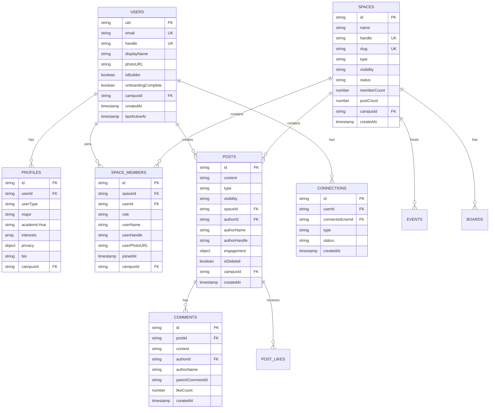
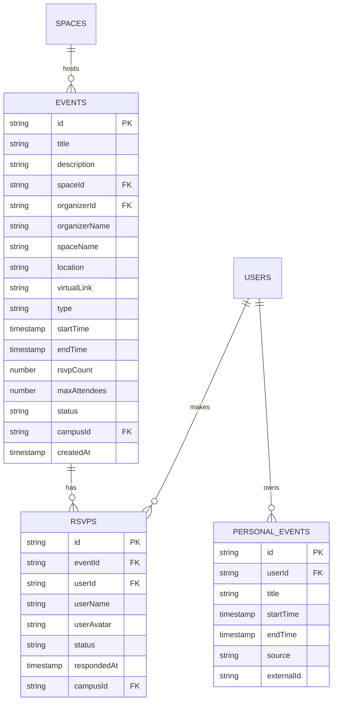
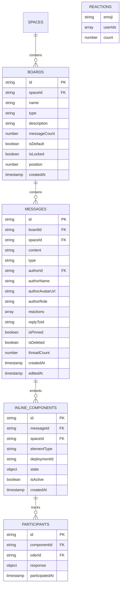
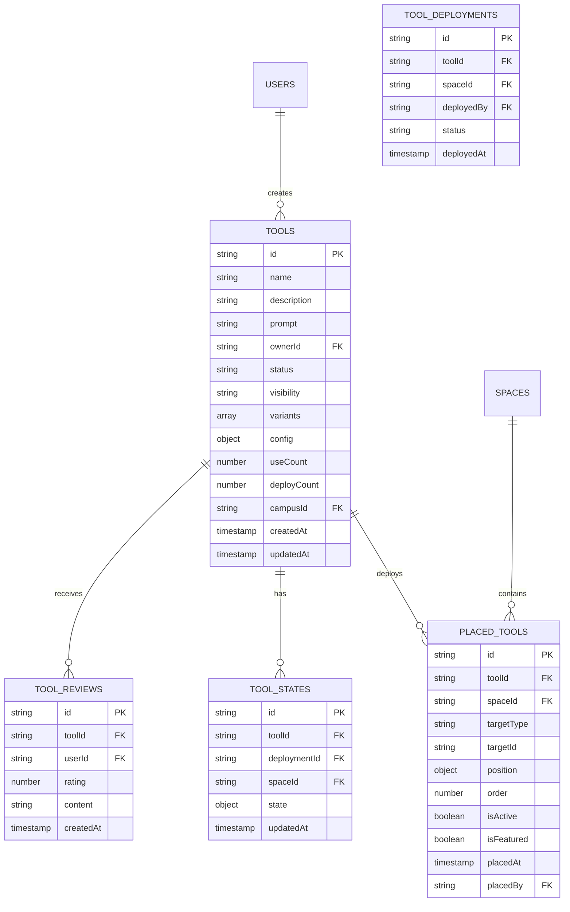
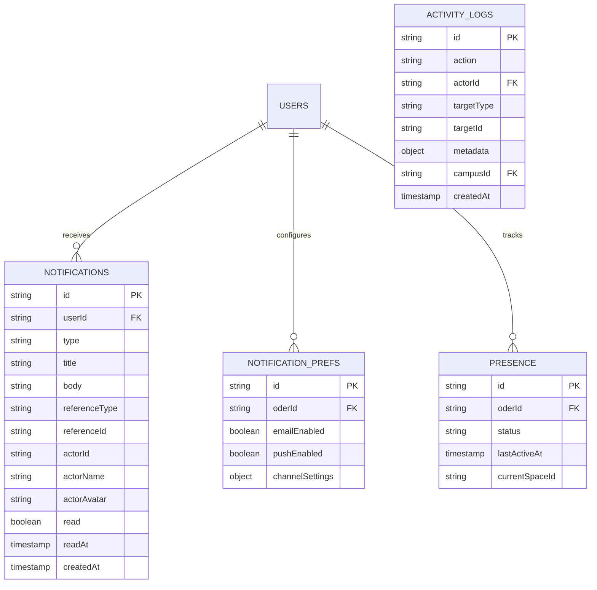
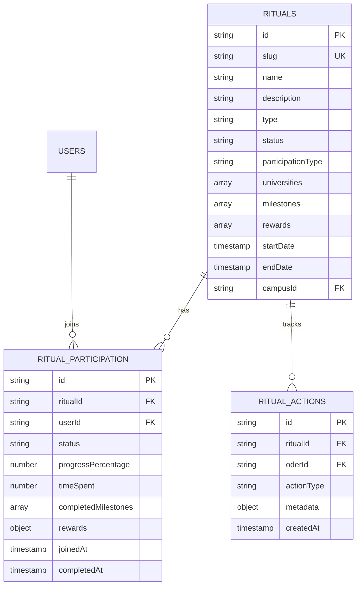

# HIVE Entity Relationship Diagram (ERD)

> Complete database schema documentation for HIVE platform
> Last updated: January 2026

## Overview

- **Database**: Firebase Firestore (NoSQL document store)
- **Collections**: 150+ (21 core + auxiliary)
- **Multi-tenancy**: Campus isolation via `campusId`
- **Document limit**: 1MB per document

---

## ERD Diagrams

### 1. Core Domain (Users, Spaces, Posts)



### 2. Events & RSVPs



### 3. Chat & Messaging



### 4. Tools & HiveLab



### 5. Notifications & Activity



### 6. Rituals & Gamification



---

## Collection Reference

### Core Collections

| Collection | Primary Key | Foreign Keys | Description |
|------------|-------------|--------------|-------------|
| `users` | `uid` | `campusId` | User accounts |
| `profiles` | `id` | `userId`, `campusId` | Extended profiles |
| `spaces` | `id` | `campusId` | Communities |
| `spaceMembers` | `id` | `spaceId`, `userId`, `campusId` | Membership junction |
| `posts` | `id` | `spaceId`, `authorId`, `campusId` | Feed content |
| `events` | `id` | `spaceId`, `organizerId`, `campusId` | Calendar events |
| `rsvps` | `id` | `eventId`, `userId`, `campusId` | Event responses |
| `tools` | `id` | `ownerId`, `campusId` | HiveLab tools |

### Subcollections

| Parent | Subcollection | Description |
|--------|---------------|-------------|
| `spaces/{spaceId}` | `boards` | Chat channels |
| `boards/{boardId}` | `messages` | Chat messages |
| `posts/{postId}` | `comments` | Post comments |
| `inline_component_state/{componentId}` | `participants` | Poll/RSVP participants |

---

## Relationship Types

### One-to-Many (1:N)

```
users (1) ─────────> profiles (N)              via userId
spaces (1) ────────> spaceMembers (N)          via spaceId
spaces (1) ────────> events (N)                via spaceId
spaces (1) ────────> posts (N)                 via spaceId
spaces (1) ────────> boards (N)                via spaceId [subcollection]
posts (1) ─────────> comments (N)              via postId [subcollection]
events (1) ────────> rsvps (N)                 via eventId
tools (1) ─────────> placed_tools (N)          via toolId
boards (1) ────────> messages (N)              via boardId [subcollection]
```

### Many-to-Many (M:N)

```
users ←───────────> spaces         via spaceMembers (role-based)
users ←───────────> events         via rsvps (status-based)
users ←───────────> users          via connections (type-based)
users ←───────────> rituals        via ritual_participation
spaces ←──────────> tools          via placed_tools
```

---

## Denormalization Map

| Collection | Denormalized Field | Source Collection | Source Field |
|------------|-------------------|-------------------|--------------|
| `spaceMembers` | `userName` | `users` | `displayName` |
| `spaceMembers` | `userHandle` | `users` | `handle` |
| `spaceMembers` | `userPhotoURL` | `users` | `photoURL` |
| `posts` | `authorName` | `profiles` | `displayName` |
| `posts` | `authorHandle` | `users` | `handle` |
| `posts` | `authorAvatar` | `users` | `photoURL` |
| `comments` | `authorName` | `profiles` | `displayName` |
| `messages` | `authorName` | `users` | `displayName` |
| `messages` | `authorAvatarUrl` | `users` | `photoURL` |
| `events` | `spaceName` | `spaces` | `name` |
| `events` | `organizerName` | `profiles` | `displayName` |
| `rsvps` | `userName` | `users` | `displayName` |
| `notifications` | `actorName` | `profiles` | `displayName` |

---

## Status Enums

### User Status
```typescript
type UserStatus = 'active' | 'suspended' | 'deleted' | 'onboarding';
```

### Space Status
```typescript
type SpaceStatus = 'draft' | 'live' | 'archived' | 'suspended';
```

### Space Visibility
```typescript
type SpaceVisibility = 'public' | 'private' | 'unlisted' | 'members_only';
```

### Event Status
```typescript
type EventStatus = 'draft' | 'published' | 'cancelled' | 'completed';
```

### RSVP Status
```typescript
type RSVPStatus = 'going' | 'maybe' | 'not_going' | 'waitlist';
```

### Tool Status
```typescript
type ToolStatus = 'draft' | 'published' | 'archived' | 'suspended';
```

### Connection Type
```typescript
type ConnectionType = 'friend' | 'follower' | 'following' | 'blocked' | 'pending';
```

### Member Role
```typescript
type MemberRole = 'owner' | 'leader' | 'moderator' | 'member';
```

---

## Index Recommendations

### Composite Indexes (Firestore)

```javascript
// Posts feed query
posts: [campusId, isDeleted, isHidden, createdAt DESC]

// Space members lookup
spaceMembers: [spaceId, campusId, role]

// Upcoming events
events: [campusId, status, startTime ASC]

// User notifications
notifications: [userId, read, createdAt DESC]

// Tool deployments
placed_tools: [spaceId, isActive, placedAt DESC]

// User connections
connections: [userId, type, status, createdAt DESC]
```

---

## Volume Classification

### High Volume (millions/month)
- `messages` - Chat messages
- `analytics_metrics` - Raw analytics events
- `presence` - Real-time presence updates
- `typing` - Typing indicators (TTL)

### Medium Volume (thousands-hundreds of thousands)
- `posts` - Feed content
- `comments` - Post comments
- `notifications` - User notifications
- `spaceMembers` - Membership records
- `connections` - User relationships

### Low Volume (hundreds-thousands)
- `spaces` - Community definitions
- `events` - Calendar events
- `tools` - HiveLab tools
- `users` - User accounts
- `schools` - Campus configurations

---

## Security Model

### Campus Isolation
All queries MUST include `campusId` filter for multi-tenancy:
```javascript
db.collection('posts')
  .where('campusId', '==', 'ub-buffalo')
  .where('isDeleted', '==', false)
```

### Role-Based Access
```typescript
// Space membership roles
owner    → Full admin (transfer, delete space)
leader   → Admin (manage members, settings)
moderator → Moderate content, manage events
member   → Basic access (post, comment, RSVP)
```

### Privacy Tiers
```typescript
// Profile visibility
public  → Visible to all authenticated users
campus  → Visible to same campus only
private → Visible to connections only
```

---

## Related Documentation

- [Database Schema Details](./DATABASE_SCHEMA.md)
- [API Routes](./API_ROUTES.md)
- [Firestore Security Rules](../apps/web/firestore.rules)
