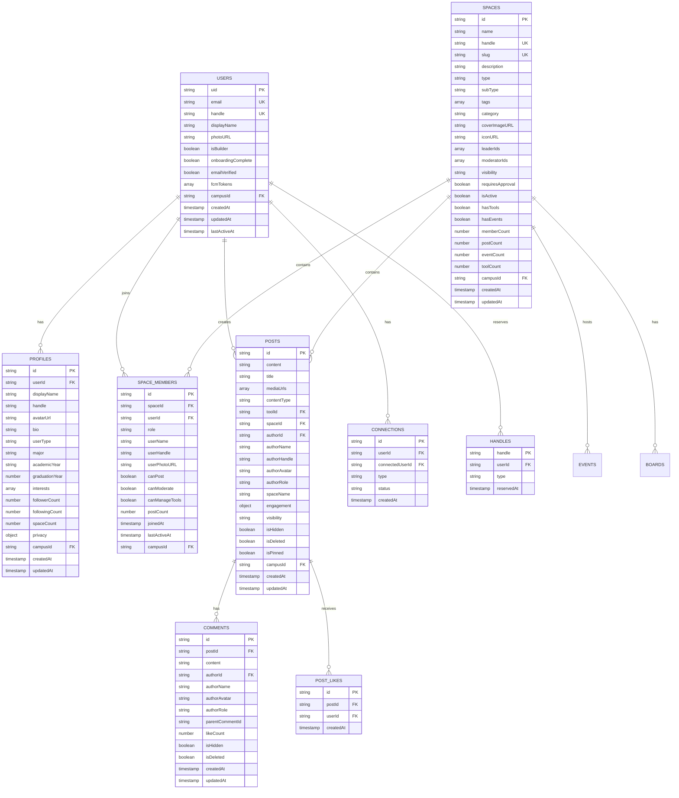

# HIVE Entity Relationship Diagram (ERD)

> Complete database schema documentation for HIVE platform
> Last updated: January 2026

## Overview

- **Database**: Firebase Firestore (NoSQL document store)
- **Collections**: 50+ (core + auxiliary + subcollections)
- **Multi-tenancy**: Campus isolation via `campusId`
- **Document limit**: 1MB per document
- **Naming convention**: Mixed (`spaceMembers`, `user_follows`, `contentReports`) — no strict convention

---

## ERD Diagrams

### 1. Core Domain (Users, Spaces, Posts)



### 2. Events & RSVPs


### 3. Chat & Messaging


**Note:** `reactions` in MESSAGES is an embedded object `Record<string, string[]>` mapping emoji to userIds, not a separate collection.

### 4. Tools & HiveLab


**Note:** The codebase uses both `placed_tools` and `deployedTools` collection names. `deployedTools` is the active collection name.

### 5. Notifications & Activity


### 6. Rituals & Gamification


### 7. Social Graph


### 8. Moderation System


### 9. Admin & Auth


### 10. Analytics


### 11. Automation & Real-time


---

## Collection Reference

### Core Collections (Top-Level)

| Collection | Primary Key | Foreign Keys | Description |
|------------|-------------|--------------|-------------|
| `users` | `uid` | `campusId` | Firebase Auth accounts |
| `profiles` | `id` | `userId`, `campusId` | Extended user profiles |
| `spaces` | `id` | `campusId` | Communities/organizations |
| `spaceMembers` | `id` | `spaceId`, `userId`, `campusId` | Membership junction |
| `posts` | `id` | `spaceId`, `authorId`, `campusId` | Feed content |
| `events` | `id` | `spaceId`, `organizerId`, `campusId` | Calendar events |
| `rsvps` | `id` | `eventId`, `userId`, `campusId` | Event responses |
| `tools` | `id` | `creatorId`, `campusId` | HiveLab tools |
| `deployedTools` | `id` | `toolId`, `spaceId`, `placedBy` | Tool placements |
| `notifications` | `id` | `userId`, `actorId` | User notifications |
| `handles` | `handle` | `userId` | Unique handle registry |
| `schools` | `id` | — | Campus configurations |

### Chat Collections

| Collection | Primary Key | Foreign Keys | Description |
|------------|-------------|--------------|-------------|
| `chatChannels` | `id` | `spaceId` | Space chat boards |
| `chatMessages` | `id` | `channelId`, `spaceId`, `authorId` | Chat messages |
| `channelMemberships` | `id` | `channelId`, `userId` | Channel read state |

### Social Collections

| Collection | Primary Key | Foreign Keys | Description |
|------------|-------------|--------------|-------------|
| `user_follows` | `id` | `followerId`, `followedId` | Follow relationships |
| `user_social_graphs` | `userId` | — | Computed social data |
| `mutual_connections` | `id` | `user1Id`, `user2Id` | Mutual friend cache |
| `user_activities` | `id` | `userId` | Activity stream |
| `connections` | `id` | `userId`, `connectedUserId` | Legacy connections |

### Moderation Collections

| Collection | Primary Key | Foreign Keys | Description |
|------------|-------------|--------------|-------------|
| `contentReports` | `id` | `reporterId`, `contentId` | User reports |
| `moderation_queue` | `id` | `contentId`, `moderatorId` | Pending reviews |
| `deletedContent` | `id` | `contentId`, `deletedBy` | Archived deletions |
| `userWarnings` | `id` | `userId`, `issuedBy` | User warnings |
| `userSuspensions` | `id` | `userId`, `issuedBy` | Temp bans |
| `userBans` | `id` | `userId`, `issuedBy` | Permanent bans |
| `moderationRules` | `id` | — | Auto-mod rules |

### Admin Collections

| Collection | Primary Key | Foreign Keys | Description |
|------------|-------------|--------------|-------------|
| `admins` | `userId` | — | Admin accounts |
| `adminActivityLogs` | `id` | `adminId` | Admin audit trail |
| `pendingAdminGrants` | `email` | `grantedBy` | Pending invites |
| `magic_links` | `id` | — | Passwordless auth |

### Analytics Collections

| Collection | Primary Key | Foreign Keys | Description |
|------------|-------------|--------------|-------------|
| `analytics_metrics` | `id` | `userId`, `spaceId`, `toolId` | Raw events |
| `analytics_aggregates` | `id` | `entityId` | Rolled up stats |
| `user_engagement_metrics` | `id` | `userId` | Per-user engagement |
| `platform_metrics` | `id` | — | Platform-wide stats |
| `content_metrics` | `id` | `contentId` | Content performance |
| `trending` | `type` | — | Trending algorithms |

### Subcollections

| Parent Path | Subcollection | Description |
|-------------|---------------|-------------|
| `spaces/{spaceId}` | `boards` | Chat channels |
| `spaces/{spaceId}` | `members` | Legacy member records |
| `spaces/{spaceId}` | `automations` | Event reminder config |
| `spaces/{spaceId}` | `posts` | Space posts (some legacy) |
| `spaces/{spaceId}` | `announcements` | Announcements |
| `boards/{boardId}` | `messages` | Chat messages |
| `posts/{postId}` | `comments` | Post comments |
| `posts/{postId}` | `likes` | Post likes |
| `users/{userId}` | `follows` | User follows |
| `users/{userId}` | `mutes` | Muted users |
| `schools/{schoolId}` | `waitlist_entries` | School waitlist |
| `feed/{cardId}` | `likes` | Feed likes |
| `inline_component_state/{id}` | `participants` | Poll/RSVP responses |
| `tools/{toolId}/state/{deployId}` | `shards` | Sharded counters |

---

## Relationship Types

### One-to-Many (1:N)

```
users (1) ─────────> profiles (N)              via userId
users (1) ─────────> notifications (N)         via userId
spaces (1) ────────> spaceMembers (N)          via spaceId
spaces (1) ────────> events (N)                via spaceId
spaces (1) ────────> posts (N)                 via spaceId
spaces (1) ────────> chatChannels (N)          via spaceId
chatChannels (1) ──> chatMessages (N)          via channelId
posts (1) ─────────> comments (N)              via postId [subcollection]
events (1) ────────> rsvps (N)                 via eventId
tools (1) ─────────> deployedTools (N)         via toolId
schools (1) ───────> users (N)                 via campusId
```

### Many-to-Many (M:N)

```
users ←───────────> spaces         via spaceMembers (role-based)
users ←───────────> events         via rsvps (status-based)
users ←───────────> users          via user_follows (directional)
users ←───────────> users          via connections (bidirectional)
users ←───────────> rituals        via ritual_participation
spaces ←──────────> tools          via deployedTools
```

---

## Denormalization Map

| Collection | Denormalized Field | Source Collection | Source Field |
|------------|-------------------|-------------------|--------------|
| `spaceMembers` | `userName` | `users` | `displayName` |
| `spaceMembers` | `userHandle` | `users` | `handle` |
| `spaceMembers` | `userPhotoURL` | `users` | `photoURL` |
| `posts` | `authorName` | `profiles` | `displayName` |
| `posts` | `authorHandle` | `users` | `handle` |
| `posts` | `authorAvatar` | `users` | `photoURL` |
| `posts` | `spaceName` | `spaces` | `name` |
| `comments` | `authorName` | `profiles` | `displayName` |
| `chatMessages` | `authorName` | `users` | `displayName` |
| `chatMessages` | `authorAvatarUrl` | `users` | `photoURL` |
| `events` | `spaceName` | `spaces` | `name` |
| `events` | `organizerName` | `profiles` | `displayName` |
| `rsvps` | `userName` | `users` | `displayName` |
| `rsvps` | `userAvatar` | `users` | `photoURL` |
| `notifications` | `actorName` | `profiles` | `displayName` |
| `notifications` | `actorAvatar` | `users` | `photoURL` |
| `deployedTools` | `toolName` | `tools` | `name` |

---

## Status Enums

### User Status
```typescript
type UserStatus = 'active' | 'suspended' | 'banned' | 'deleted' | 'onboarding';
```

### Space Status
```typescript
type SpaceStatus = 'draft' | 'live' | 'archived' | 'suspended';
```

### Space Type
```typescript
type SpaceType =
  | 'student_organizations'
  | 'university_organizations'
  | 'greek_life'
  | 'campus_living'
  | 'hive_exclusive';
```

### Space Visibility
```typescript
type SpaceVisibility = 'public' | 'private' | 'unlisted' | 'members_only';
```

### Event Status
```typescript
type EventStatus = 'draft' | 'published' | 'live' | 'completed' | 'cancelled' | 'archived';
```

### RSVP Status
```typescript
type RSVPStatus = 'going' | 'maybe' | 'not_going' | 'waitlist';
```

### Tool Status
```typescript
type ToolStatus = 'draft' | 'published' | 'archived' | 'suspended';
```

### Connection Type
```typescript
type ConnectionType = 'friend' | 'follower' | 'following' | 'blocked' | 'pending';
```

### Member Role
```typescript
type MemberRole = 'owner' | 'leader' | 'moderator' | 'member';
```

### Notification Type
```typescript
type NotificationType =
  | 'space_invite'
  | 'space_join'
  | 'post_like'
  | 'post_comment'
  | 'mention'
  | 'event_reminder'
  | 'follow'
  | 'system';
```

### Moderation Status
```typescript
type ModerationStatus = 'pending' | 'reviewing' | 'resolved' | 'dismissed';
```

### Report Priority
```typescript
type ReportPriority = 'low' | 'medium' | 'high' | 'critical';
```

---

## Index Recommendations

### Composite Indexes (Firestore)

```javascript
// Posts feed query
posts: [campusId, isDeleted, isHidden, createdAt DESC]
posts: [spaceId, isDeleted, createdAt DESC]

// Space members lookup
spaceMembers: [spaceId, campusId, role]
spaceMembers: [userId, campusId]

// Upcoming events
events: [campusId, status, startTime ASC]
events: [spaceId, startTime ASC]

// User notifications
notifications: [userId, read, createdAt DESC]

// Tool deployments
deployedTools: [spaceId, isActive, placedAt DESC]
deployedTools: [profileId, isActive, placedAt DESC]

// User connections
connections: [userId, type, status, createdAt DESC]

// Social graph
user_follows: [followerId, createdAt DESC]
user_follows: [followedId, createdAt DESC]

// Moderation
contentReports: [campusId, status, createdAt DESC]
moderation_queue: [status, priority, createdAt ASC]

// Analytics
analytics_metrics: [campusId, eventType, timestamp DESC]
user_activities: [userId, activityType, createdAt DESC]
```

---

## Volume Classification

### High Volume (millions/month)
- `chatMessages` - Real-time chat
- `analytics_metrics` - Raw analytics events
- `presence` - Real-time presence updates
- `user_activities` - Activity stream

### Medium Volume (thousands-hundreds of thousands)
- `posts` - Feed content
- `comments` - Post comments
- `notifications` - User notifications
- `spaceMembers` - Membership records
- `user_follows` - Follow relationships
- `rsvps` - Event responses

### Low Volume (hundreds-thousands)
- `spaces` - Community definitions
- `events` - Calendar events
- `tools` - HiveLab tools
- `users` - User accounts
- `schools` - Campus configurations
- `admins` - Admin accounts
- `contentReports` - User reports

### TTL Collections (auto-expire)
- `magic_links` - 15 min TTL
- `presence` - 5 min TTL
- `realtimeMessages` - 1 hour TTL
- `sentReminders` - 30 day TTL

---

## Security Model

### Campus Isolation
All queries MUST include `campusId` filter for multi-tenancy:
```javascript
db.collection('posts')
  .where('campusId', '==', 'ub-buffalo')
  .where('isDeleted', '==', false)
```

### Role-Based Access
```typescript
// Space membership roles (descending privilege)
owner    → Full admin (transfer, delete space)
leader   → Admin (manage members, settings, tools)
moderator → Moderate content, manage events
member   → Basic access (post, comment, RSVP)
```

### Admin Roles
```typescript
// Platform admin roles
super_admin → Full platform access
admin       → Most admin functions
moderator   → Content moderation only
support     → Read-only + user support
```

### Privacy Tiers
```typescript
// Profile visibility
public  → Visible to all authenticated users
campus  → Visible to same campus only
private → Visible to connections only
```

### Content Visibility
```typescript
// Post/space visibility
public       → Anyone on campus
private      → Members only
members_only → Space members only
unlisted     → Anyone with link
```

---

## Base Document Pattern

All documents inherit these fields:
```typescript
interface BaseDocument {
  id: string;                // Auto-generated document ID
  campusId: string;          // Campus isolation key
  createdAt: Timestamp;      // Creation timestamp
  updatedAt: Timestamp;      // Last update timestamp
  createdBy?: string;        // User UID who created
}
```

---

## Legacy Collections (Dead Code)

The following collections have references in the codebase but are **not actively used**:

| Collection | Location | Notes |
|------------|----------|-------|
| `clubs` | `analytics.ts`, `notifications.ts` | Predates "spaces" unification. Count returns 0. |
| `reports` | `feed/report.ts` | Superseded by `contentReports` in moderation service |

These should be cleaned up in a future refactor.

---

## Related Documentation

- [Database Schema Details](./DATABASE_SCHEMA.md) - TypeScript interfaces
- [Firestore Security Rules](../infrastructure/firebase/firestore.rules)
- [Firestore Indexes](../infrastructure/firebase/firestore.indexes.json)
