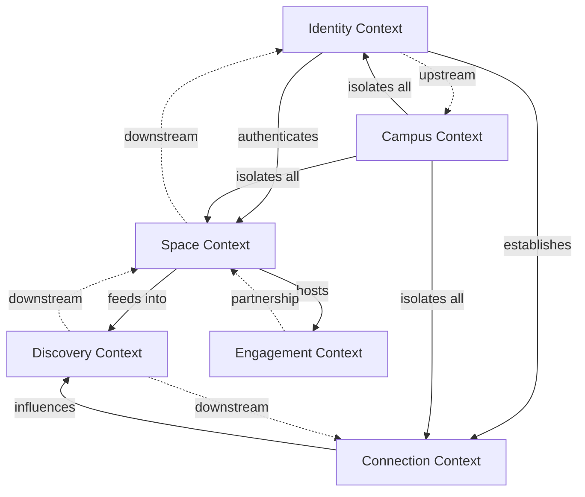

# HIVE Domain-Driven Design Foundation

## 1. Ubiquitous Language (SPEC.md Derived)

### Core Terms (Use These EVERYWHERE - Code, PRDs, Discussions)

#### User States
- **Panic** - A student's moment of academic/social anxiety requiring immediate relief
- **Relief** - The resolution of panic through community connection (<10 seconds target)
- **Hook Cycle** - The behavioral loop: Panic → Discovery → Relief → Investment
- **Completion Rate** - The % of users who finish a multi-step interaction (70% target)

#### Social Constructs
- **Space** - A community hub where students organize around shared interests/needs
  - NOT "group", "channel", "room", or "forum"
- **Leader** - The student who created and manages a Space
  - NOT "admin", "owner", "moderator"
- **Member** - A student who has joined a Space
  - NOT "subscriber", "follower", "participant"
- **Post** - Content shared within a Space
  - NOT "message", "update", "entry"

#### Identity Elements
- **Handle** - A user's unique identifier (@username format)
  - NOT "username", "id", "nickname"
- **Profile** - A student's campus identity and presence
  - NOT "account", "page", "bio"
- **Campus** - The university affiliation (currently UB-only)
  - NOT "school", "institution", "organization"

#### Engagement Mechanics
- **Ritual** - A campus-wide engagement campaign with milestones
  - NOT "challenge", "campaign", "event"
- **Tool** - A leader-created interactive element for Spaces
  - NOT "widget", "app", "plugin"
- **Discovery** - The process of finding relevant Spaces/content
  - NOT "search", "explore", "browse"

#### Behavioral Currencies
- **Social Proof** - Validation through peer presence/activity
- **Insider Knowledge** - Exclusive campus information
- **Connection Capital** - Relationship strength/network value

#### System States
- **Campus Isolation** - Data segregation by university (hard boundary)
- **Onboarded** - User has completed initial setup
- **Magic Link** - Passwordless authentication token
- **Feed** - The real-time stream of Space activity
  - NOT "timeline", "stream", "dashboard"

---

## 2. Bounded Contexts

### Identity Context
**Purpose**: Manage student identity and authentication
**Core Concepts**: User, Profile, Handle, Authentication, Onboarding
**Aggregates**:
- User (Aggregate Root)
  - Profile
  - Handle
  - Campus affiliation
  - Onboarding state

### Space Context
**Purpose**: Organize communities and content
**Core Concepts**: Space, Member, Post, Comment, Leader privileges
**Aggregates**:
- Space (Aggregate Root)
  - Members collection
  - Posts collection
  - Space settings
  - Leader permissions

### Engagement Context
**Purpose**: Drive behavioral habits through rituals and tools
**Core Concepts**: Ritual, Participation, Tool, Milestone
**Aggregates**:
- Ritual (Aggregate Root)
  - Participation records
  - Milestones
  - Campus progress
- Tool (Aggregate Root)
  - Configuration
  - Space association
  - Usage analytics

### Connection Context
**Purpose**: Manage social graph and relationships
**Core Concepts**: Connection, Friend, Request, Privacy
**Aggregates**:
- UserConnections (Aggregate Root)
  - Friends list
  - Pending requests
  - Connection strength
  - Privacy settings

### Discovery Context
**Purpose**: Surface relevant content and reduce panic-to-relief time
**Core Concepts**: Feed, Algorithm, Recommendation, Search
**Aggregates**:
- UserFeed (Aggregate Root)
  - Personalization settings
  - View history
  - Engagement metrics

### Campus Context
**Purpose**: Enforce university boundaries and manage expansion
**Core Concepts**: Campus, Waitlist, School verification
**Aggregates**:
- Campus (Aggregate Root)
  - Active status
  - Member count
  - Settings
- Waitlist (Aggregate Root)
  - Entries by school
  - Verification rules

---

## 3. Context Map



### Relationship Types:
- **Upstream/Downstream**: Campus Context is upstream (changes affect all downstream)
- **Partnership**: Engagement and Space contexts work as partners
- **Customer/Supplier**: Identity supplies authentication to all other contexts

---

## 4. Key Aggregates and Invariants

### User Aggregate (Identity Context)
**Invariants**:
- Email must be from verified campus domain
- Handle must be unique within campus
- Profile completion affects feature access
- Onboarding must complete before full access

### Space Aggregate (Space Context)
**Invariants**:
- Must have exactly one Leader
- Campus isolation enforced on all operations
- Member count affects visibility algorithms
- Posts inherit Space campus isolation

### Ritual Aggregate (Engagement Context)
**Invariants**:
- 70% completion rate target for all interactions
- Participation tracked per campus
- Milestones must be achievable within semester

### UserConnections Aggregate (Connection Context)
**Invariants**:
- Connections only within same campus
- Mutual consent required for friend status
- Privacy settings cascade to all connections

---

## 5. Domain Events (Behavioral Triggers from SPEC)

### Panic Events (Triggers)
```typescript
StudentPanickedEvent {
  userId: string
  triggerType: 'academic' | 'social' | 'fomo' | 'loneliness'
  timestamp: Date
  context: 'morning' | 'afternoon' | 'evening' | 'latenight'
}
```

### Discovery Events (Actions)
```typescript
SpaceDiscoveredEvent {
  userId: string
  spaceId: string
  discoveryMethod: 'feed' | 'search' | 'recommendation'
  timeFromPanic: number // seconds
}

SpaceJoinedEvent {
  userId: string
  spaceId: string
  completionStage: number // 0.0 - 1.0
}
```

### Relief Events (Outcomes)
```typescript
ReliefAchievedEvent {
  userId: string
  reliefType: 'found_community' | 'got_help' | 'insider_knowledge'
  timeToRelief: number // must be <10 seconds
  willShare: boolean
}
```

### Investment Events (Habit Formation)
```typescript
UserInvestedEvent {
  userId: string
  investmentType: 'profile_update' | 'space_creation' | 'content_share'
  depth: 'surface' | 'actual' | 'shadow'
  completionRate: number // tracking toward 70% target
}

HabitFormedEvent {
  userId: string
  behaviorPattern: string
  consecutiveDays: number
  automaticResponse: boolean // "never panic alone" achieved
}
```

---

## 6. Implementation Priority

### Phase 1: Core Domain Layer
1. Create domain modules for each Bounded Context
2. Implement Aggregates with invariant enforcement
3. Add Repository interfaces (not implementations)
4. Create Domain Events and event bus

### Phase 2: Test-Driven Development
1. Write behavior tests for each Aggregate
2. Test invariants and business rules
3. Test Domain Event generation
4. Mock repositories for pure domain testing

### Phase 3: Infrastructure Adapters
1. Implement Firebase repositories
2. Add event persistence
3. Create API adapters
4. Maintain clear hex architecture boundaries

### Phase 4: Behavioral Metrics
1. Instrument Domain Events
2. Track completion rates
3. Measure panic-to-relief time
4. Monitor habit formation

---

## 7. Code Organization Structure

```
packages/
├── domain/                    # Pure domain logic (no frameworks)
│   ├── identity/
│   │   ├── aggregates/
│   │   │   └── user.aggregate.ts
│   │   ├── events/
│   │   │   ├── user-created.event.ts
│   │   │   └── user-onboarded.event.ts
│   │   ├── value-objects/
│   │   │   ├── email.vo.ts
│   │   │   └── handle.vo.ts
│   │   └── repositories/
│   │       └── user.repository.interface.ts
│   ├── space/
│   │   ├── aggregates/
│   │   ├── events/
│   │   └── repositories/
│   ├── engagement/
│   ├── connection/
│   ├── discovery/
│   └── campus/
├── application/               # Use cases / Application services
│   ├── identity/
│   │   ├── commands/
│   │   │   └── create-user.command.ts
│   │   └── queries/
│   │       └── get-user-profile.query.ts
│   └── space/
├── infrastructure/            # External dependencies
│   ├── firebase/
│   │   └── repositories/
│   │       └── firebase-user.repository.ts
│   └── api/
│       └── routes/
└── tests/
    ├── domain/               # Pure domain tests (no deps)
    ├── integration/          # Cross-boundary tests
    └── e2e/                 # Full stack tests
```

---

## Next Steps

1. **Immediate**: Review and approve this Ubiquitous Language with all stakeholders
2. **This Week**: Refactor existing code to use consistent terminology
3. **Next Sprint**: Implement core Identity and Space aggregates with TDD
4. **Ongoing**: Enforce language in PRs, documentation, and discussions

Remember: The language and boundaries defined here are THE source of truth. Any deviation weakens the entire system.