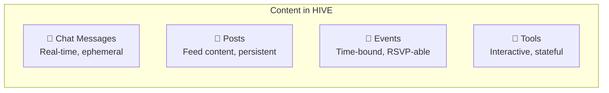
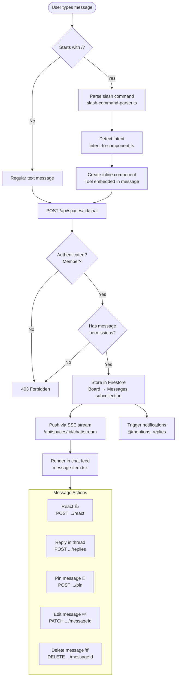
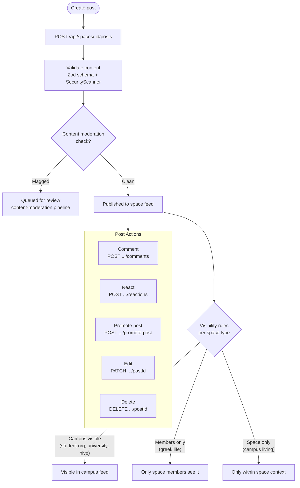
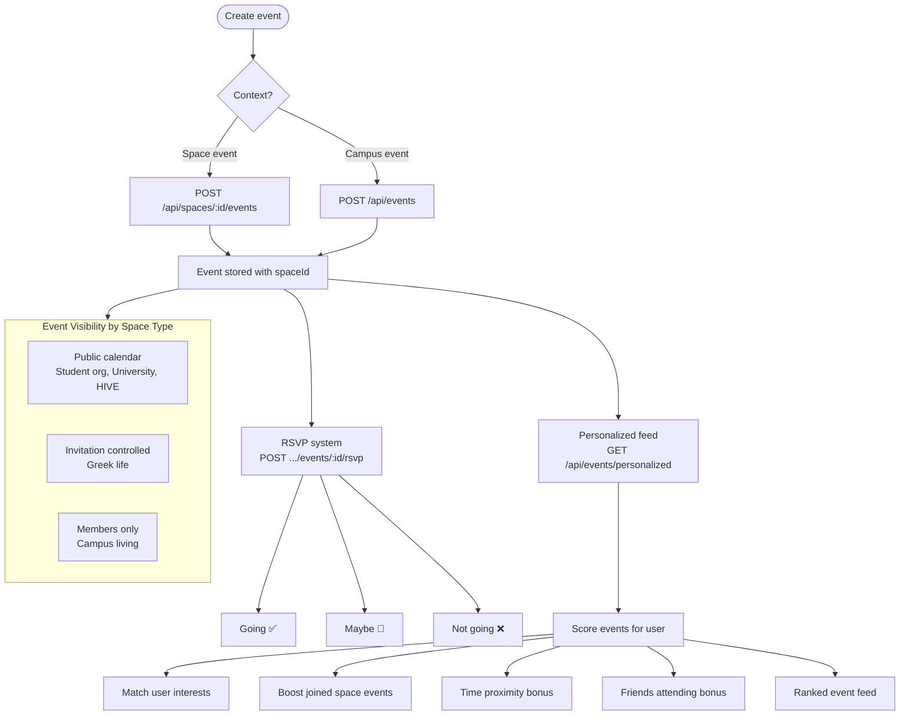
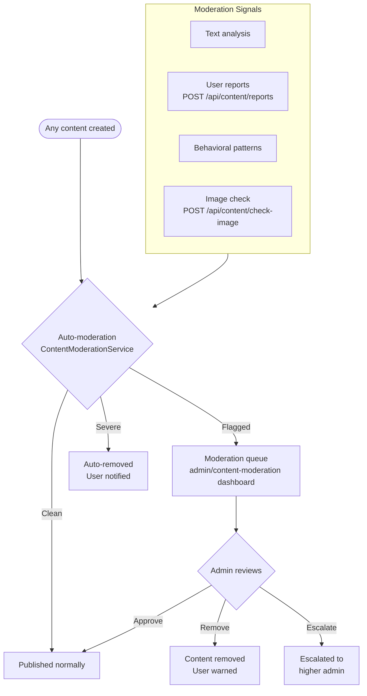
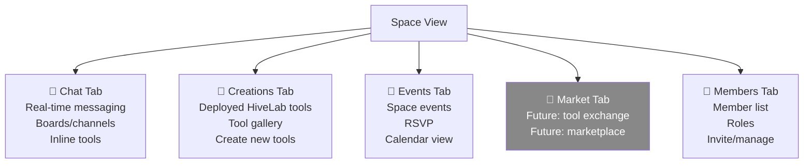

# Content Flow

## Content Types

## Chat Message Lifecycle

### Message Permission Matrix

| Action | Owner | Admin | Moderator | Member | Guest |
|--------|-------|-------|-----------|--------|-------|
| Send message | ✅ | ✅ | ✅ | ✅ | ❌ |
| Edit own message | ✅ | ✅ | ✅ | ✅ | ❌ |
| Edit any message | ✅ | ✅ | ✅ | ❌ | ❌ |
| Delete own message | ✅ | ✅ | ✅ | ✅ | ❌ |
| Delete any message | ✅ | ✅ | ✅ | ❌ | ❌ |
| Pin/unpin | ✅ | ✅ | ✅ | ❌ | ❌ |
| React | ✅ | ✅ | ✅ | ✅ | ❌ |
| Reply in thread | ✅ | ✅ | ✅ | ✅ | ❌ |

## Post Lifecycle

## Event Lifecycle

## Content Moderation Pipeline

## Content in Spaces: The 5-Tab Model

## Chat Features

| Feature | Route | Status |
|---------|-------|--------|
| Send message | `POST /spaces/:id/chat` | ✅ |
| Real-time stream | `GET /spaces/:id/chat/stream` (SSE) | ✅ |
| Message reactions | `POST /spaces/:id/chat/:msgId/react` | ✅ |
| Threaded replies | `POST /spaces/:id/chat/:msgId/replies` | ✅ |
| Pin messages | `POST /spaces/:id/chat/:msgId/pin` | ✅ |
| Get pinned | `GET /spaces/:id/chat/pinned` | ✅ |
| Edit message | `PATCH /spaces/:id/chat/:msgId` | ✅ |
| Delete message | `DELETE /spaces/:id/chat/:msgId` | ✅ |
| Search messages | `GET /spaces/:id/chat/search` | ✅ |
| Typing indicator | `POST /spaces/:id/chat/typing` | ✅ |
| Read receipts | `POST /spaces/:id/chat/read` | ✅ |
| Intent detection | `POST /spaces/:id/chat/intent` | ✅ |
| Inline components | Slash commands → tool embeds | ✅ |
