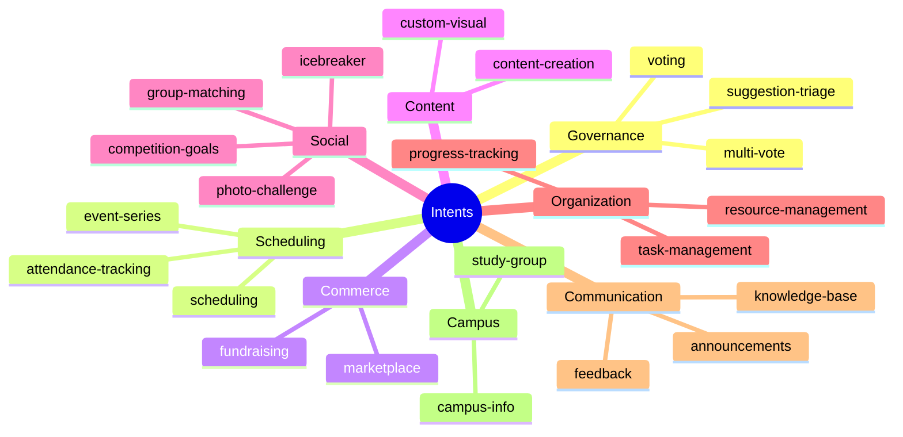
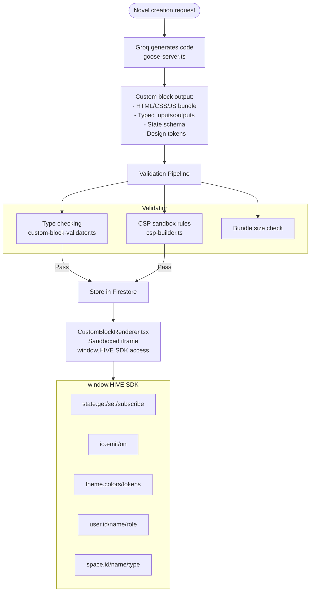
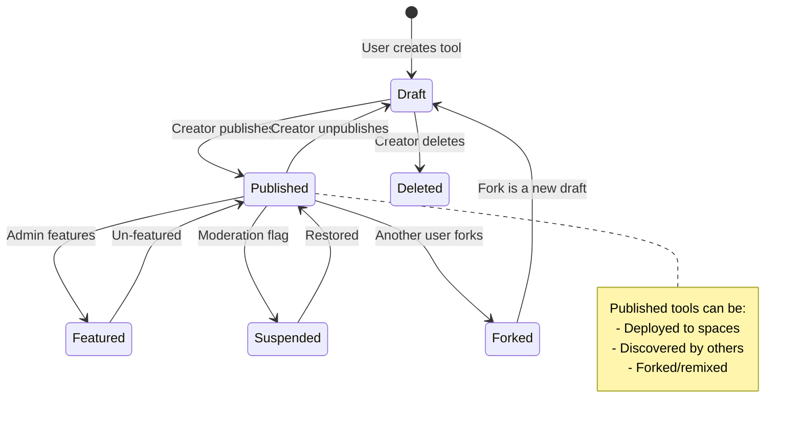
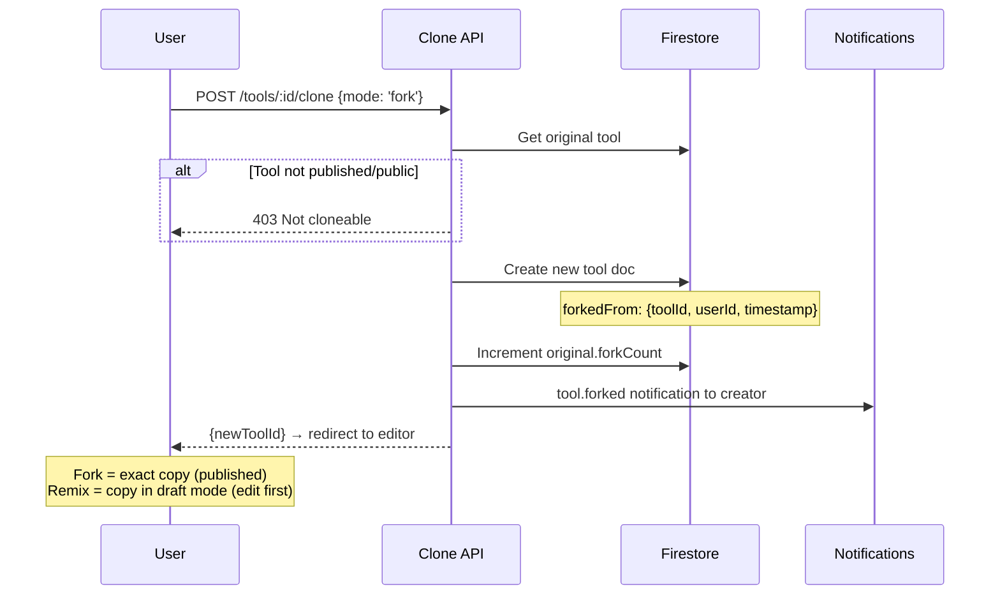
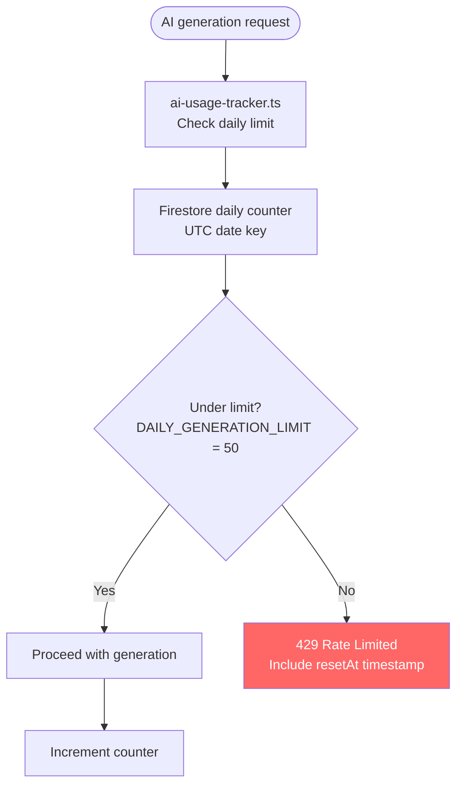

# HiveLab & Tools

HiveLab is the creation engine. Everything else is distribution infrastructure for what HiveLab produces.

## The Two-Path Creation Model

```mermaid
flowchart TD
    User([User describes what they need]) --> Intent[Intent Detection<br/>detectIntent() — 22 intents<br/>Keyword scoring, no LLM call]
    
    Intent --> Resolution{Resolution Path}
    
    Resolution -->|"80%+ of requests"| Composition[Composition Pattern<br/>50 patterns across 8 categories<br/>FREE, INSTANT]
    Resolution -->|"Single element match"| Element[Single Element<br/>38 registered elements<br/>FREE, INSTANT]
    Resolution -->|"Novel/complex request"| CustomBlock[Custom Block<br/>AI-generated via Groq<br/>$0.01, ~2 seconds]
    
    Composition --> Enrich[Space Context Enrichment<br/>enrichPatternForSpace()]
    Enrich --> Tool[Tool Document Created]
    
    Element --> Tool
    CustomBlock --> Generate[Groq LLM generates code<br/>Full HIVE SDK access]
    Generate --> Validate[Validate output<br/>CSP + type checking]
    Validate --> Tool
    
    Tool --> Deploy{Deploy where?}
    Deploy -->|Space| SpaceTool[Available in space tabs]
    Deploy -->|Personal| PersonalTool[In user's lab dashboard]
    Deploy -->|Public| PublicTool[Discoverable by others]

    style Composition fill:#6c6,color:#fff
    style Element fill:#6c6,color:#fff
    style CustomBlock fill:#f90,color:#fff
```

## 22 Intents



## 50 Composition Patterns (8 Categories)

| Category | Count | Examples |
|----------|-------|---------|
| **Governance** | 8 | Simple poll, ranked choice, proposal system, budget vote, amendment process, quorum poll, anonymous ballot, consent vote |
| **Scheduling** | 6 | Event planner, recurring schedule, availability finder, shift scheduler, deadline tracker, booking system |
| **Commerce** | 6 | Dues collector, fundraiser, split bill, marketplace listing, auction, budget tracker |
| **Content** | 6 | Newsletter, photo gallery, resource library, wiki, announcement board, blog |
| **Social** | 6 | Icebreaker, matchmaker, challenge board, leaderboard, shoutout wall, secret santa |
| **Events** | 6 | RSVP manager, event series, check-in system, after-event survey, volunteer signup, carpool coordinator |
| **Org Management** | 6 | Role assignment, meeting agenda, minutes tracker, task board, onboarding checklist, attendance log |
| **Campus Life** | 6 | Study group finder, roommate matcher, course review, textbook exchange, campus guide, meal planner |

### Pattern Resolution

```mermaid
flowchart TD
    Intent[Detected Intent] --> GetPattern[getPatternForIntent()<br/>Match intent to patterns]
    GetPattern --> Score[scorePattern()<br/>Keyword overlap scoring]
    Score --> BestMatch{Pattern found?}
    
    BestMatch -->|Yes| Clone[clonePattern()<br/>Deep copy for customization]
    Clone --> Enrich[enrichPatternForSpace()]
    
    BestMatch -->|No| Fallback{Single element?}
    Fallback -->|Yes| ElementComp[Single-element composition]
    Fallback -->|No| CustomBlock[Custom block generation<br/>Groq LLM call]
    
    subgraph Enrichment["Space Context Enrichment"]
        SpaceType{Space Type?}
        SpaceType -->|Greek Life| GL[Add pledge class fields<br/>Chapter terminology<br/>Formal language]
        SpaceType -->|Student Org| SO[Add position fields<br/>Committee structure]
        SpaceType -->|Campus Living| CL[Add building/floor fields<br/>RA terminology]
        SpaceType -->|University Org| UO[Add formal language<br/>Compliance fields]
        
        Size{Space Size?}
        Size -->|"<20 members"| Small[Trim configs<br/>Simpler defaults]
        Size -->|"100+ members"| Large[Add pagination<br/>Batch operations]
    end
    
    Enrich --> SpaceType
    Enrich --> Size
```

## Custom Block System



### Custom Block Architecture

| Component | File | Purpose |
|-----------|------|---------|
| Types | `packages/core/src/domain/hivelab/custom-block.types.ts` | Block type definitions |
| SDK | `packages/ui/src/lib/hivelab/hive-sdk.ts` | `window.HIVE` runtime API |
| Renderer | `packages/ui/src/design-system/components/hivelab/CustomBlockRenderer.tsx` | Sandboxed iframe renderer |
| CSP | `packages/ui/src/lib/hivelab/csp-builder.ts` | Content Security Policy |
| Element | `packages/ui/src/components/hivelab/elements/custom/custom-block-element.tsx` | Element registry entry |
| Validator | `packages/core/src/domain/hivelab/validation/custom-block-validator.ts` | Output validation |
| Generator | `packages/core/src/application/hivelab/custom-block-generator.service.ts` | Generation service |
| Create API | `apps/web/src/app/api/tools/create-custom-block/route.ts` | API endpoint |

## Tool Lifecycle



## Fork / Remix Flow



## Discovery & Distribution

```mermaid
flowchart TD
    Created([Tool created in Space A]) --> Publish[Creator publishes tool]
    
    Publish --> Discover[Discovery API<br/>GET /api/tools/discover]
    
    Discover --> Filters{Filters}
    Filters --> Category[By category<br/>governance, scheduling, etc.]
    Filters --> SpaceType[By space type<br/>student_org, greek_life, etc.]
    Filters --> Sort[By sort<br/>popular, recent, trending]
    Filters --> Search[By search query]
    
    Sort --> Trending[Trending algorithm:<br/>score = (forks×3 + uses) × recencyMultiplier<br/>recency = 1/(1 + daysSince/7)]
    
    Discover --> Results[Tool results with:<br/>id, title, description, category,<br/>creator, spaceOrigin, forkCount,<br/>useCount, createdAt]
    
    Results --> Fork[Fork to my space]
    Results --> Remix[Remix and customize]
    Results --> View[View standalone<br/>/t/[toolId]]
```

## Tool State: Dual-Scoped

```mermaid
flowchart LR
    Tool[Tool Instance] --> Personal[Personal State<br/>Per-user, private<br/>getStateDocumentId(toolId, userId)]
    Tool --> Shared[Shared State<br/>Per-space, collaborative<br/>getStateDocumentId(toolId, spaceId)]
    
    Personal --> LocalFirst[Optimistic local update]
    Shared --> LocalFirst
    
    LocalFirst --> Debounce[300ms debounce<br/>scheduleActionStateSync()]
    Debounce --> Firestore[(Firestore)]
    
    Firestore --> SSE[SSE stream<br/>/api/tools/:id/state/stream]
    SSE --> Client[Client hook<br/>use-tool-state-stream.ts]
    Client --> Merge[Merge with local state<br/>Last-write-wins by timestamp]
```

## Rate Limiting



## Notification Hooks

| Event | Recipient | Message |
|-------|-----------|---------|
| `tool.forked` | Original creator | "Someone forked your [tool name]" |
| `tool.deployed` | Space members | "[tool name] was added to [space name]" |
| `tool.milestone` | Creator | "Your [tool name] hit [10/50/100/500/1000] uses!" |
| `tool.updated` | Users who forked it | "[tool name] was updated" |

## Key Files

| File | Lines | Purpose |
|------|-------|---------|
| `use-tool-runtime.ts` | 1,048 | Client-side tool execution runtime |
| `composition-patterns.ts` | ~2,000 | 50 patterns + scoring + enrichment |
| `intent-detection.ts` | — | 22 intents with keyword scoring |
| `create-from-intent/route.ts` | — | 3-tier resolution: pattern → element → custom block |
| `goose-server.ts` | — | Groq LLM integration + validation |
| `ai-usage-tracker.ts` | — | Firebase Admin rate limiting |
| `use-tool-state-stream.ts` | — | SSE client hook with optimistic updates |
| `tool-notifications.ts` | — | Tool event notification triggers |
