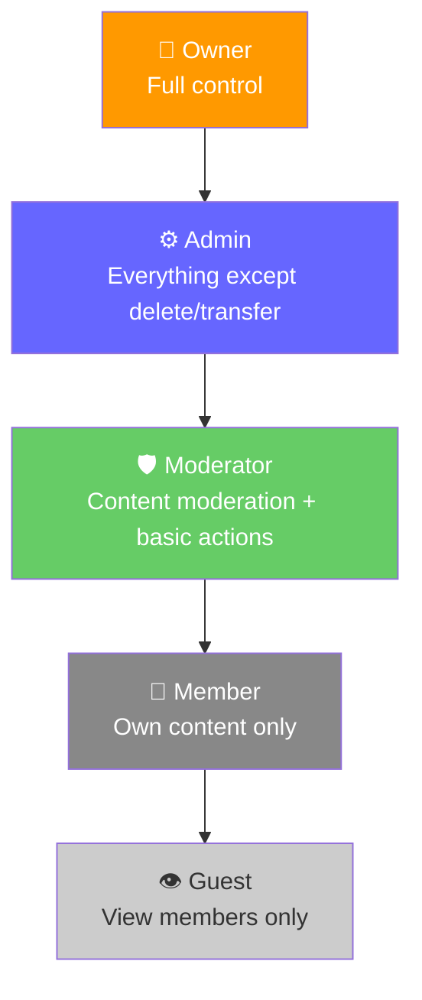
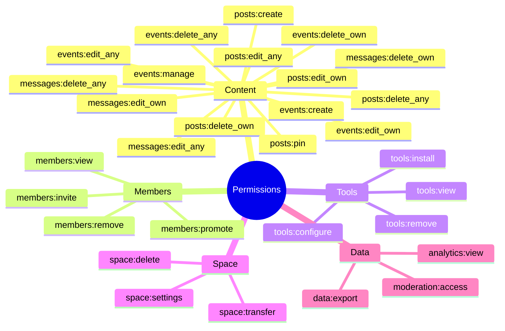
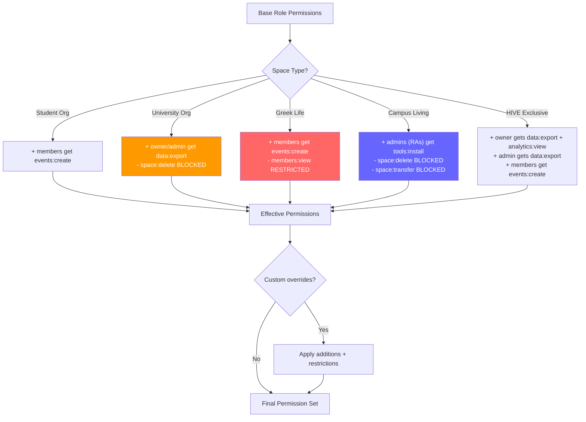
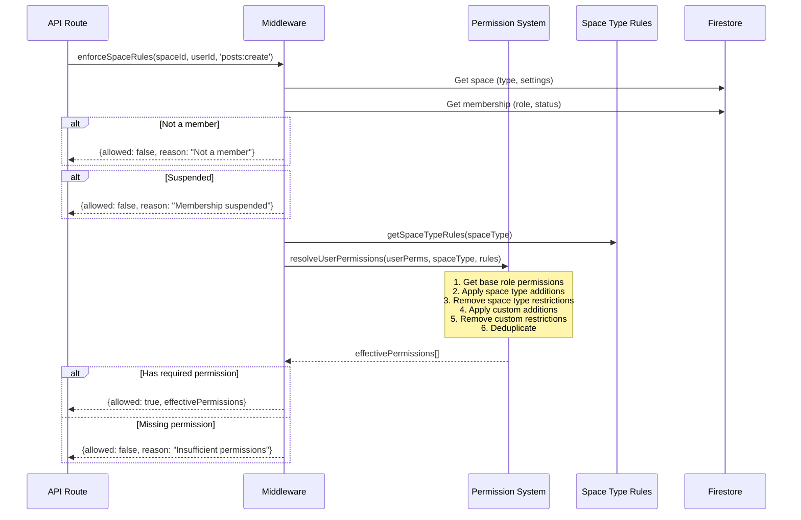
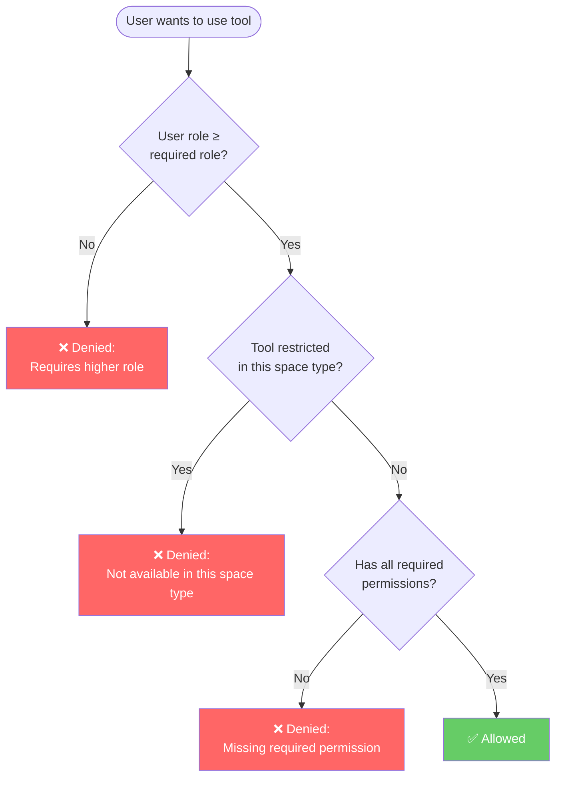
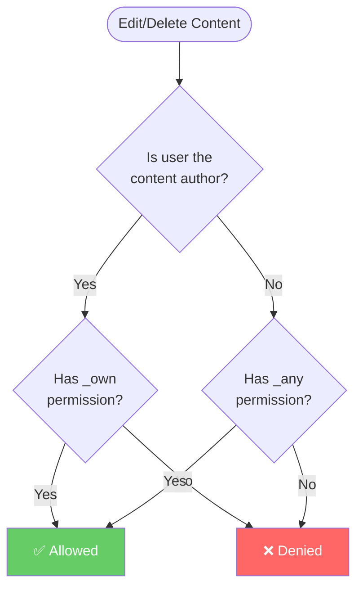

# Permission System

Permissions cascade: **Base Role → Space Type Modifiers → Custom Overrides → Restrictions**

## Role Hierarchy

## Permission Categories

## Base Permission Matrix

| Permission | Owner | Admin | Moderator | Member | Guest |
|-----------|-------|-------|-----------|--------|-------|
| **posts:create** | ✅ | ✅ | ✅ | ✅ | ❌ |
| **posts:edit_own** | ✅ | ✅ | ✅ | ✅ | ❌ |
| **posts:edit_any** | ✅ | ✅ | ✅ | ❌ | ❌ |
| **posts:delete_own** | ✅ | ✅ | ✅ | ✅ | ❌ |
| **posts:delete_any** | ✅ | ✅ | ✅ | ❌ | ❌ |
| **posts:pin** | ✅ | ✅ | ✅ | ❌ | ❌ |
| **events:create** | ✅ | ✅ | ✅ | ❌* | ❌ |
| **events:edit_own** | ✅ | ✅ | ✅ | ❌ | ❌ |
| **events:edit_any** | ✅ | ✅ | ❌ | ❌ | ❌ |
| **events:delete_own** | ✅ | ✅ | ✅ | ❌ | ❌ |
| **events:delete_any** | ✅ | ✅ | ❌ | ❌ | ❌ |
| **events:manage** | ✅ | ✅ | ❌ | ❌ | ❌ |
| **messages:edit_own** | ✅ | ✅ | ✅ | ✅ | ❌ |
| **messages:edit_any** | ✅ | ✅ | ✅ | ❌ | ❌ |
| **messages:delete_own** | ✅ | ✅ | ✅ | ✅ | ❌ |
| **messages:delete_any** | ✅ | ✅ | ✅ | ❌ | ❌ |
| **members:view** | ✅ | ✅ | ✅ | ✅ | ✅ |
| **members:invite** | ✅ | ✅ | ✅ | ❌ | ❌ |
| **members:remove** | ✅ | ✅ | ❌ | ❌ | ❌ |
| **members:promote** | ✅ | ✅ | ❌ | ❌ | ❌ |
| **tools:view** | ✅ | ✅ | ✅ | ✅ | ❌ |
| **tools:install** | ✅ | ✅ | ❌ | ❌ | ❌ |
| **tools:configure** | ✅ | ✅ | ❌ | ❌ | ❌ |
| **tools:remove** | ✅ | ✅ | ❌ | ❌ | ❌ |
| **space:settings** | ✅ | ✅ | ❌ | ❌ | ❌ |
| **space:delete** | ✅ | ❌ | ❌ | ❌ | ❌ |
| **space:transfer** | ✅ | ❌ | ❌ | ❌ | ❌ |
| **data:export** | ✅ | ❌ | ❌ | ❌ | ❌ |
| **analytics:view** | ✅ | ❌ | ❌ | ❌ | ❌ |
| **moderation:access** | ✅ | ✅ | ✅ | ❌ | ❌ |

*\* Members get `events:create` in student_organizations, greek_life, and hive_exclusive via space type modifiers*

## Space Type Modifiers

After base role permissions are calculated, space type modifiers **add** or **restrict** permissions:

### Space Type Modifier Details

| Space Type | Additions | Restrictions |
|-----------|-----------|-------------|
| **Student Org** | Members: `events:create` | — |
| **University Org** | Owner/Admin: `data:export` | `space:delete` blocked for all |
| **Greek Life** | Members: `events:create` | `members:view` restricted |
| **Campus Living** | Admin (RA): `tools:install`; Members: `tools:view` | `space:delete` + `space:transfer` blocked |
| **HIVE Exclusive** | Owner: `data:export` + `analytics:view`; Admin: `data:export`; Members: `events:create` | — |

## Permission Resolution Flow

## Tool Permission Presets

Tools have their own permission requirements that stack on top of user permissions:

| Tool Type | Required Role | Required Permissions | Restricted In |
|-----------|--------------|---------------------|---------------|
| **Project Management** | Member | `posts:create`, `events:create` | — |
| **Administrative** | Admin | `space:settings`, `data:export` | — |
| **Social Planning** | Member | `events:create` | — |
| **Resource Booking** | Member | — | Greek Life |
| **Member Development** | Moderator | `members:view` | — |
| **Analytics** | Admin | `analytics:view`, `data:export` | — |

## Own vs Any: Content Permission Logic

A critical distinction in the permission system:

**Example:** A `member` has `posts:edit_own` + `posts:delete_own` but NOT `posts:edit_any`. They can edit their own posts but cannot edit others' posts. A `moderator` has both `_own` and `_any` — they can edit anyone's posts.
