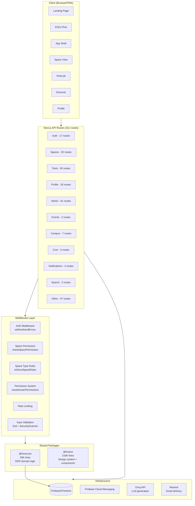
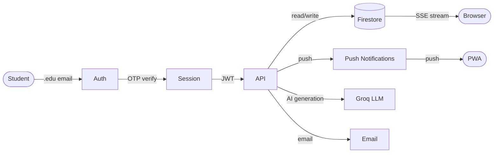

# Platform Overview

## System Architecture



## Data Flow



## Package Structure

```
HIVE/
├── apps/
│   ├── web/                    # Main Next.js 15 app
│   │   ├── src/
│   │   │   ├── app/
│   │   │   │   ├── api/        # 311 API routes (~86K lines)
│   │   │   │   ├── s/[handle]/ # Space pages
│   │   │   │   ├── lab/        # HiveLab pages
│   │   │   │   ├── discover/   # Discovery page
│   │   │   │   ├── enter/      # Entry/auth pages
│   │   │   │   └── ...
│   │   │   ├── hooks/          # 47 hooks (~9.5K lines)
│   │   │   ├── lib/            # 118 modules (~37K lines)
│   │   │   └── components/     # UI components
│   │   └── ...
│   └── admin/                  # Admin dashboard app
├── packages/
│   ├── core/                   # Domain logic (~83K lines)
│   │   ├── domain/             # Entities, value objects, services
│   │   ├── application/        # Use cases, services
│   │   ├── infrastructure/     # Repository implementations
│   │   └── server.ts           # Server-only exports
│   └── ui/                     # Design system (~216K lines)
│       ├── design-system/      # Base components
│       └── components/         # Feature components
└── docs/
    └── architecture/           # You are here
```

## Key Integrations

| Service | Purpose | Used By |
|---------|---------|---------|
| **Firebase/Firestore** | Primary database, auth tokens, file storage | All routes |
| **Firebase Cloud Messaging** | Push notifications (18 types) | Notification service |
| **Groq** | LLM for custom block generation | HiveLab tool creation |
| **Resend** | Email delivery (OTP codes, invites) | Auth, notifications |
| **Vercel** | Hosting, edge functions, cron | Deployment |

## Scale Numbers

| Metric | Count |
|--------|-------|
| API routes | 311 |
| Total route code | ~86K lines |
| Core package | ~83K lines |
| UI package | ~216K lines |
| Hooks | 47 (~9.5K lines) |
| Lib modules | 118 (~37K lines) |
| HiveLab elements | 38 registered |
| Composition patterns | 50 |
| Space types | 5 |
| Pre-seeded spaces | 698 |
| Pre-seeded events | 2,467 |
| Notification types | 18 |
