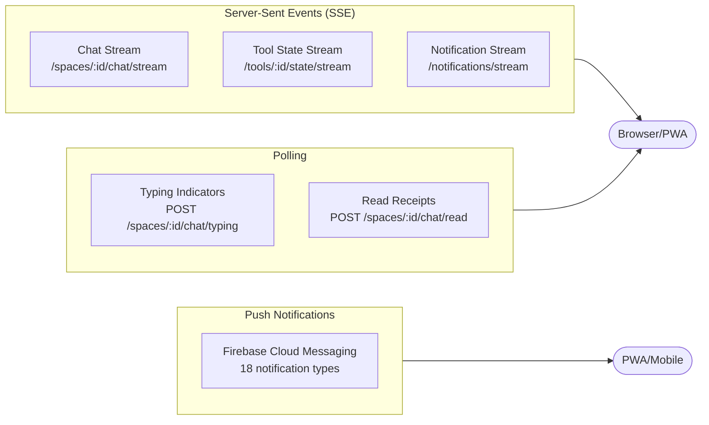
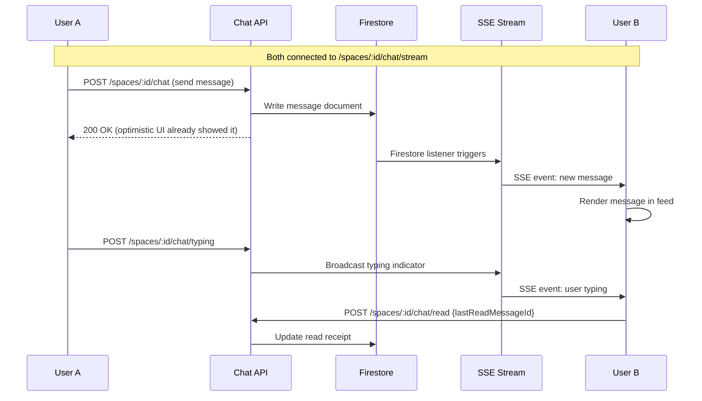
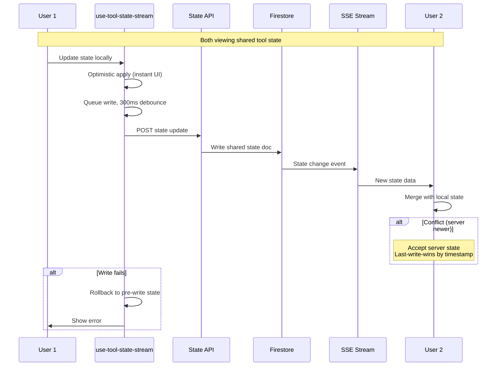
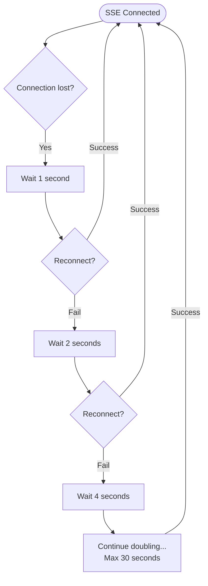
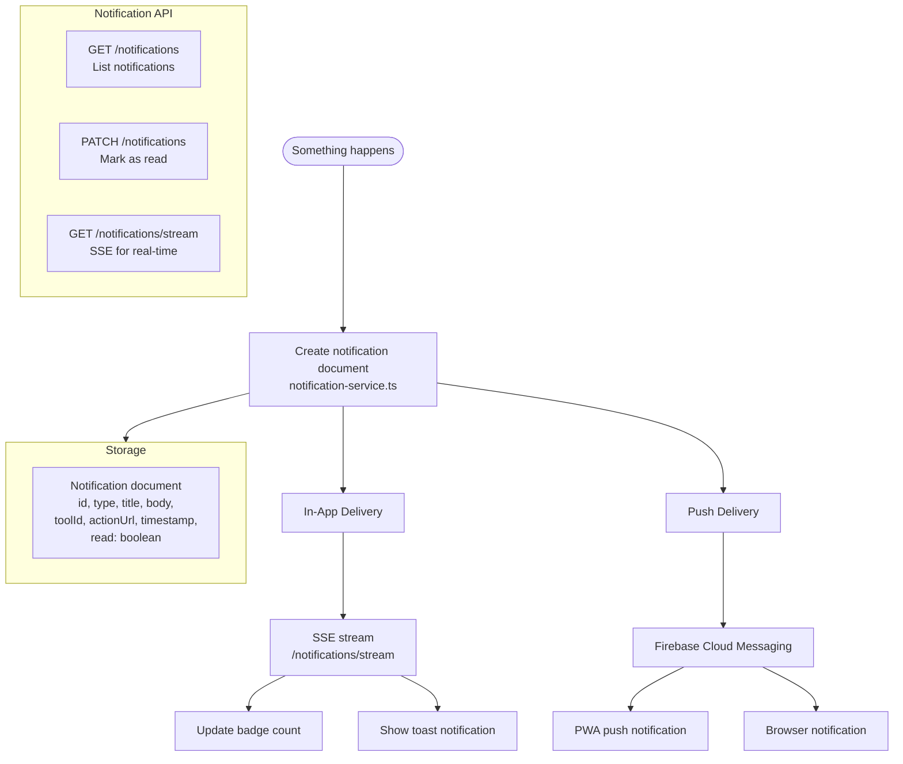

# Real-Time Systems

## Overview



## Chat Real-Time Flow



## Tool State Sync



### Reconnection Strategy



## Notification System

### 18 Push Notification Types

```mermaid
graph TD
    subgraph Space["Space Notifications"]
        JoinReq[Join request received]
        JoinApproved[Join request approved]
        MemberJoined[New member joined]
        RoleChanged[Role changed]
        SpaceInvite[Space invitation]
    end
    
    subgraph Chat["Chat Notifications"]
        Mention[@mention in chat]
        Reply[Reply to your message]
        Pin[Your message pinned]
    end
    
    subgraph Tool["Tool Notifications"]
        ToolForked[Tool forked]
        ToolDeployed[Tool deployed to space]
        ToolMilestone[Tool hit milestone]
        ToolUpdated[Forked tool updated]
    end
    
    subgraph Event["Event Notifications"]
        EventCreated[New event in space]
        EventReminder[Event starting soon]
        RSVPUpdate[RSVP update]
    end
    
    subgraph System["System Notifications"]
        Welcome[Welcome message]
        Achievement[Achievement unlocked]
        SystemAlert[System alert]
    end
```

### Notification Delivery



## Cron Jobs (Scheduled)

| Job | Route | Schedule | Purpose |
|-----|-------|----------|---------|
| Tool lifecycle | `/api/cron/tool-lifecycle` | Periodic | Clean up expired tools, update metrics |
| Tool automations | `/api/cron/tool-automations` | Periodic | Run scheduled tool actions |
| Event sync | `/api/cron/sync-events` | Periodic | Sync external calendar events |
| Setup orchestration | `/api/cron/setup-orchestration` | Periodic | Process setup queue |
| Automations | `/api/cron/automations` | Periodic | Run space automations |
