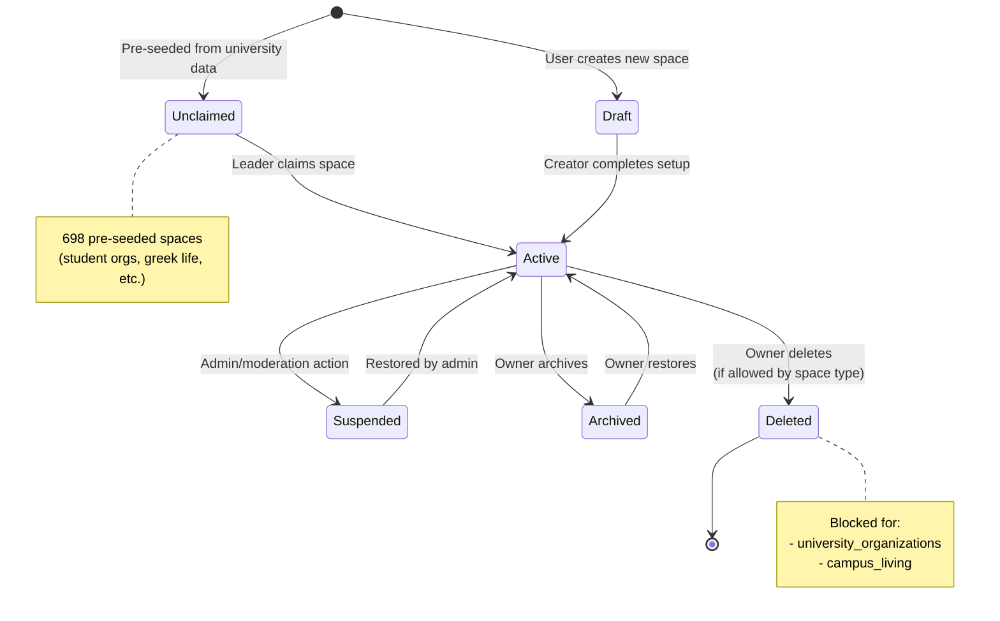
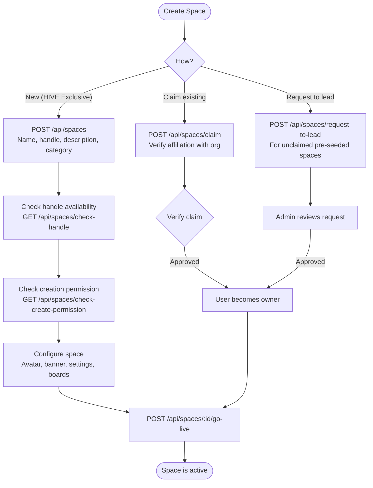
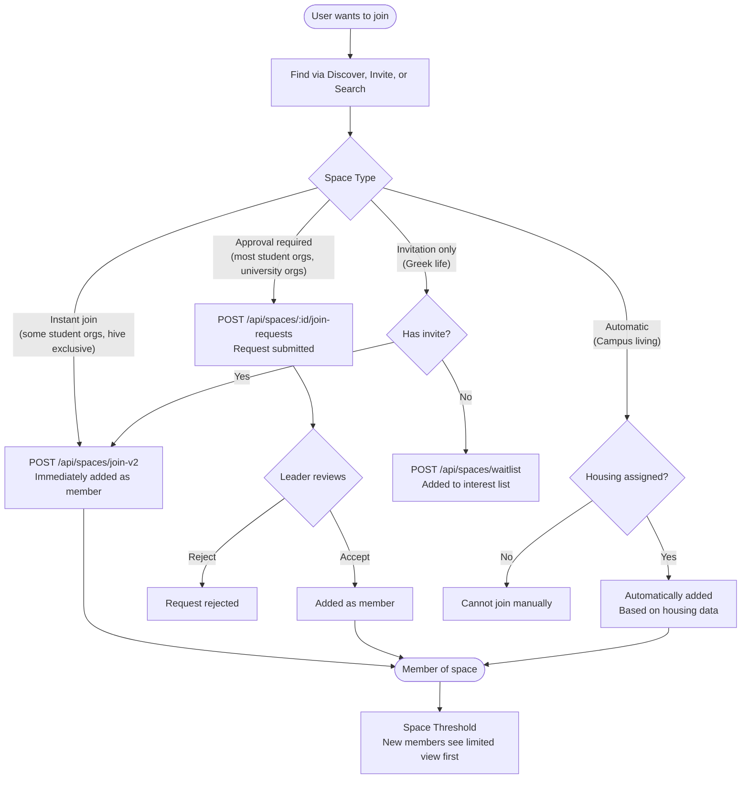
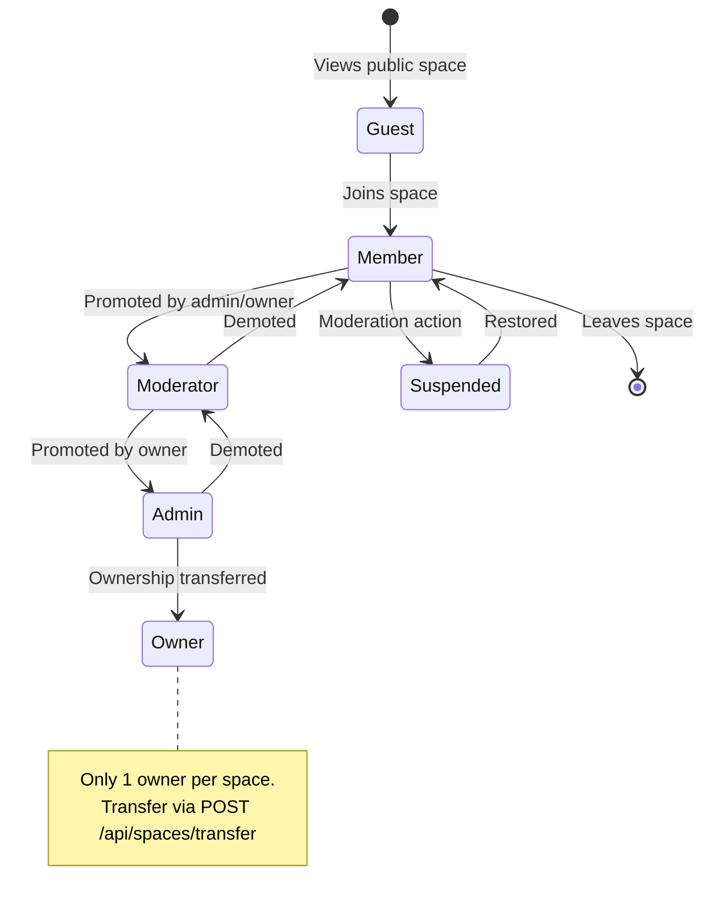
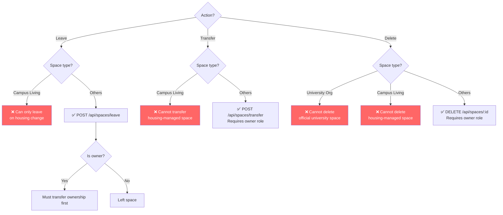
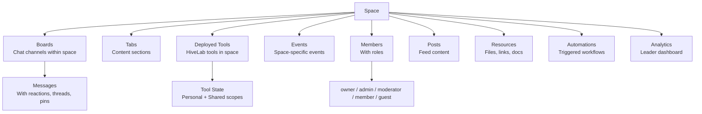

# Space Lifecycle

## Space States

## Creation Flow

## Join Flow (Detailed)

## Member Roles & Transitions

## Leave / Transfer / Delete Rules

## Space Internal Structure

## Key API Routes

| Route | Method | Purpose |
|-------|--------|---------|
| `/api/spaces` | GET/POST | List/create spaces |
| `/api/spaces/join-v2` | POST | Join a space |
| `/api/spaces/leave` | POST | Leave a space |
| `/api/spaces/claim` | POST | Claim unclaimed space |
| `/api/spaces/transfer` | POST | Transfer ownership |
| `/api/spaces/browse-v2` | GET | Browse/discover spaces |
| `/api/spaces/recommended` | GET | Personalized recommendations |
| `/api/spaces/search` | GET | Search spaces |
| `/api/spaces/mine` | GET | User's joined spaces |
| `/api/spaces/:id` | GET/PATCH/DELETE | Space CRUD |
| `/api/spaces/:id/members` | GET/POST/PATCH/DELETE | Member management |
| `/api/spaces/:id/boards` | GET/POST | Board (channel) management |
| `/api/spaces/:id/tabs` | GET/POST/PATCH | Tab management |
| `/api/spaces/:id/tools` | GET/POST | Tool deployment |
| `/api/spaces/:id/events` | GET/POST | Space events |
| `/api/spaces/:id/analytics` | GET | Space analytics |
| `/api/spaces/:id/automations` | GET/POST | Automation management |
| `/api/spaces/:id/go-live` | POST | Publish space |
| `/api/spaces/:id/invite` | GET/POST | Invite links |
| `/api/spaces/:id/join-requests` | GET/POST | Manage join requests |
