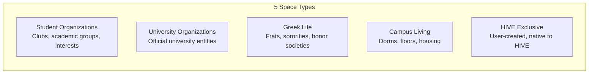
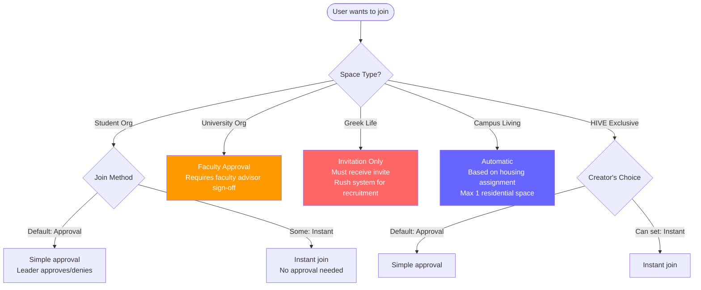
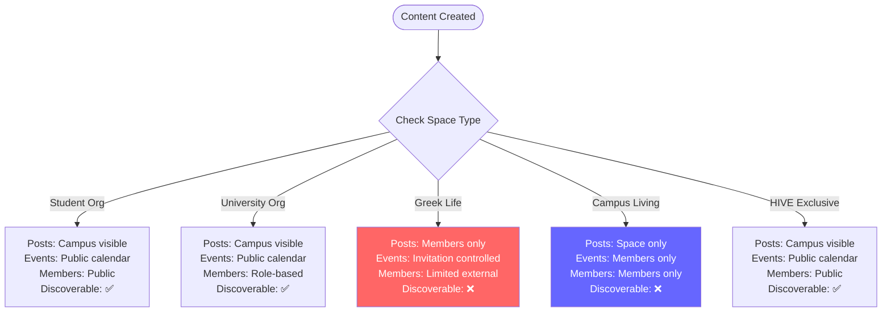
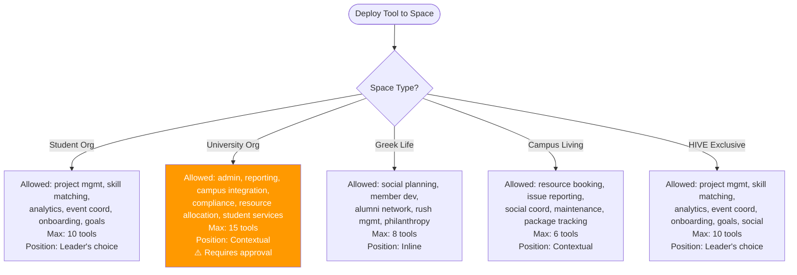
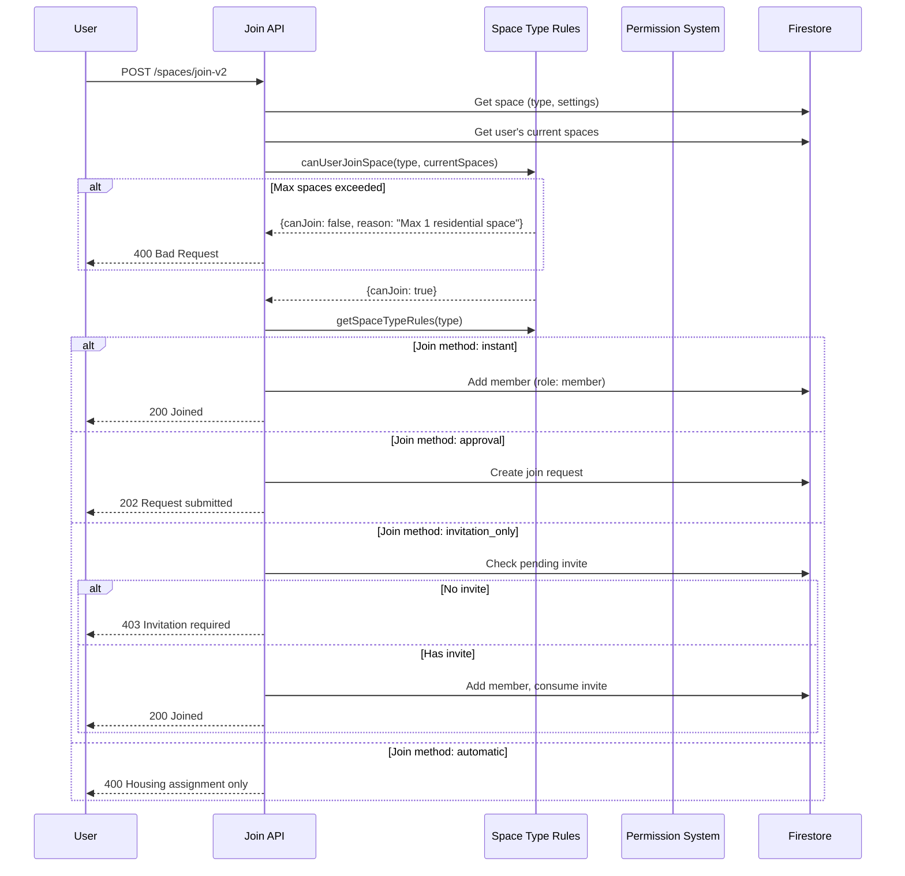

# Space Type Rules

Every space in HIVE has a **type** that determines its behavior. Same UI, different rules.

## Space Types

## Membership Rules

### Membership Matrix

| Rule | Student Org | University Org | Greek Life | Campus Living | HIVE Exclusive |
|------|-------------|---------------|------------|---------------|----------------|
| **Max spaces** | Unlimited | Unlimited | Unlimited | **1** | Unlimited |
| **Join method** | Approval | Approval | **Invitation only** | **Automatic** | Approval (creator sets) |
| **Leave restriction** | None | None | None | **Housing change only** | None |
| **Approval process** | Simple | **Faculty approval** | **Rush system** | N/A | Simple |
| **Special roles** | President, VP, Treasurer, Secretary | Faculty Advisor, Admin, Student Leader | President, VP, Rush Chair, Social Chair, Pledge Educator | **RA**, Floor President, Building Coordinator | Creator, Admin, Moderator |

## Visibility Rules

### Visibility Matrix

| Content | Student Org | University Org | Greek Life | Campus Living | HIVE Exclusive |
|---------|-------------|---------------|------------|---------------|----------------|
| **Posts** | Campus visible | Campus visible | **Members only** | **Space only** | Campus visible |
| **Events** | Public calendar | Public calendar | **Invitation controlled** | **Members only** | Public calendar |
| **Member profiles** | Public | **Role-based** | **Limited external** | **Members only** | Public |
| **Discoverable** | ✅ | ✅ | ❌ | ❌ | ✅ |

## Tool Rules

### Tool Rules Matrix

| Rule | Student Org | University Org | Greek Life | Campus Living | HIVE Exclusive |
|------|-------------|---------------|------------|---------------|----------------|
| **Max tools** | 10 | 15 | 8 | 6 | 10 |
| **Requires approval** | No | **Yes** | No | No | No |
| **Default position** | Leader's choice | Contextual | Inline | Contextual | Leader's choice |
| **Allowed categories** | 6 | 6 | 6 | 6 | 7 |

## Special Features & Compliance

| Space Type | Special Features | Compliance |
|-----------|-----------------|------------|
| **Student Org** | External partnerships, fundraising, competitions | — |
| **University Org** | University systems, official comms, resource access | **FERPA, accessibility, university policies** |
| **Greek Life** | Alumni connections, traditions, philanthropy, recruitment | — |
| **Campus Living** | Housing integration, maintenance systems, community resources | — |
| **HIVE Exclusive** | Custom branding, flexible governance, user created | — |

## Decision Flow: Complete Join Sequence

