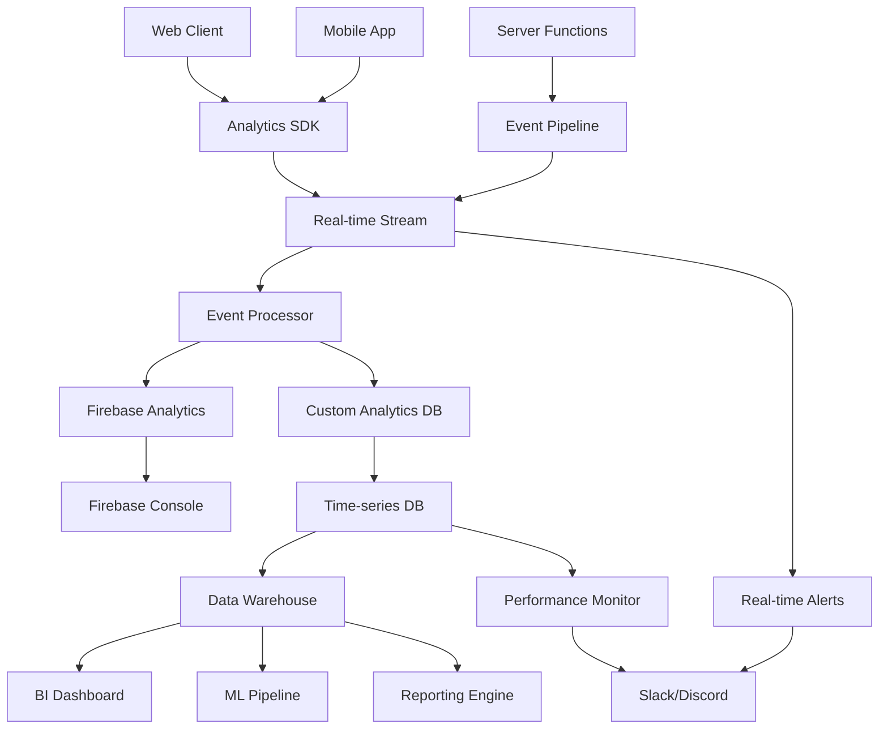

# HIVE Analytics & Monitoring Strategy

## 1. System Architecture Overview

### Current Foundation (✅ Implemented)
- **Platform Metrics**: Daily scheduled functions for core KPIs
- **User Engagement**: Activity tracking with engagement scoring
- **Content Analytics**: View tracking and engagement metrics
- **Achievement System**: Streak-based rewards and milestones
- **Firebase Analytics**: Basic event tracking infrastructure

### Enhanced Architecture (🚧 To Build)


## 2. Core Metrics & KPIs

### 2.1 Engagement Metrics
- **Daily/Weekly/Monthly Active Users (DAU/WAU/MAU)**
- **Session Duration & Frequency**
- **Feature Adoption Rates**
- **User Retention Curves (D1, D7, D30)**
- **Churn Prediction Score**

### 2.2 Social Platform Metrics
- **Space Creation & Join Rates**
- **Post Engagement (likes, comments, shares)**
- **Message Volume & Response Rates**
- **Event Creation & Attendance**
- **Friend/Connection Growth**

### 2.3 Creator Tool Metrics
- **Tool Builder Usage**
- **Element Library Adoption**
- **Canvas Interaction Patterns**
- **Configuration Completion Rates**
- **Shared Tool Performance**

### 2.4 Business Metrics
- **User Acquisition Cost (CAC)**
- **Lifetime Value (LTV)**
- **Conversion Funnel Metrics**
- **Revenue Attribution**
- **Growth Rate & Virality**

## 3. Real-time Monitoring System

### 3.1 Application Performance Monitoring (APM)
```typescript
// Performance monitoring hooks
interface PerformanceMetrics {
  pageLoadTime: number;
  timeToInteractive: number;
  firstContentfulPaint: number;
  largestContentfulPaint: number;
  cumulativeLayoutShift: number;
  firstInputDelay: number;
}

// Error tracking
interface ErrorEvent {
  message: string;
  stack: string;
  userId?: string;
  sessionId: string;
  userAgent: string;
  url: string;
  timestamp: number;
  severity: 'low' | 'medium' | 'high' | 'critical';
}
```

### 3.2 Real-time Alerting Rules
- **Error Rate > 5%** → Critical Alert
- **Response Time > 3s** → Warning Alert
- **User Engagement Drop > 20%** → Business Alert
- **Server CPU > 80%** → Infrastructure Alert
- **DAU Drop > 15%** → Product Alert

### 3.3 Health Check Endpoints
```typescript
// System health monitoring
interface HealthCheck {
  status: 'healthy' | 'degraded' | 'down';
  database: boolean;
  authentication: boolean;
  storage: boolean;
  functions: boolean;
  responseTime: number;
  timestamp: number;
}
```

## 4. Advanced Analytics Features

### 4.1 User Journey Analytics
- **Funnel Analysis**: Registration → Onboarding → First Action → Retention
- **Cohort Analysis**: User behavior by acquisition date/source
- **Path Analysis**: Common user navigation patterns
- **Drop-off Analysis**: Where users disengage

### 4.2 A/B Testing Framework
```typescript
interface ExperimentConfig {
  id: string;
  name: string;
  hypothesis: string;
  variants: Array<{
    id: string;
    name: string;
    traffic: number; // percentage
    config: Record<string, any>;
  }>;
  targetingRules: {
    userSegments?: string[];
    geoLocation?: string[];
    platform?: ('web' | 'mobile')[];
  };
  metrics: string[]; // KPIs to track
  duration: number; // days
  confidenceLevel: number; // 95%, 99%
}
```

### 4.3 Predictive Analytics
- **Churn Risk Scoring**: ML model to predict user churn
- **Content Recommendation**: Personalized content scoring
- **Engagement Optimization**: Best time to send notifications
- **Growth Prediction**: User base and revenue forecasting

## 5. Privacy & Compliance

### 5.1 Data Privacy Framework
- **GDPR Compliance**: Right to be forgotten, data portability
- **CCPA Compliance**: Data transparency and opt-out
- **COPPA Compliance**: For users under 13
- **Data Minimization**: Collect only necessary data

### 5.2 Data Anonymization
```typescript
interface AnonymizedEvent {
  sessionId: string; // Anonymized session identifier
  timestamp: number;
  action: string;
  properties: Record<string, any>; // No PII
  hashedUserId?: string; // For aggregation without identification
}
```

### 5.3 Consent Management
- **Granular Consent**: Essential, Performance, Functional, Marketing
- **Cookie Management**: First-party vs third-party tracking
- **Analytics Opt-out**: User control over data collection

## 6. Implementation Roadmap

### Phase 1: Foundation Enhancement (Week 1-2)
- [ ] Set up error tracking and performance monitoring
- [ ] Implement real-time alerting system
- [ ] Create health check endpoints
- [ ] Build basic BI dashboard

### Phase 2: Advanced Analytics (Week 3-4)
- [ ] Implement funnel and cohort analysis
- [ ] Build A/B testing framework
- [ ] Create user journey tracking
- [ ] Set up predictive analytics pipeline

### Phase 3: Intelligence & Automation (Week 5-6)
- [ ] Deploy ML models for churn prediction
- [ ] Implement automated insights generation
- [ ] Build recommendation systems
- [ ] Create automated reporting

### Phase 4: Optimization & Scale (Week 7-8)
- [ ] Performance optimization
- [ ] Cost optimization for analytics
- [ ] Advanced privacy controls
- [ ] Enterprise-grade monitoring

## 7. Technical Stack

### 7.1 Data Collection
- **Frontend**: Custom Analytics SDK (TypeScript)
- **Backend**: Firebase Functions + Custom Event Pipeline
- **Mobile**: Native SDK with privacy controls

### 7.2 Data Processing
- **Stream Processing**: Firebase Functions + Pub/Sub
- **Batch Processing**: Cloud Functions + Cloud Scheduler
- **Data Validation**: JSON Schema + Custom Rules

### 7.3 Data Storage
- **Real-time**: Firebase Firestore
- **Analytics**: BigQuery or PostgreSQL
- **Time-series**: InfluxDB or Firebase RTDB
- **Data Warehouse**: BigQuery or Snowflake

### 7.4 Visualization & BI
- **Real-time Dashboard**: Custom React Dashboard
- **Business Intelligence**: Looker Studio or Metabase
- **Alerting**: Slack/Discord Webhooks
- **Reporting**: Automated PDF/Email Reports

## 8. Success Metrics

### 8.1 Technical Metrics
- **Data Pipeline Reliability**: 99.9% uptime
- **Real-time Processing**: <100ms latency
- **Data Accuracy**: 99.5% data quality score
- **Alert Response**: <2 minutes to critical alerts

### 8.2 Business Impact Metrics
- **Data-Driven Decisions**: 80% of product decisions backed by data
- **Experiment Velocity**: 5+ A/B tests running simultaneously
- **Insight Discovery**: 10+ actionable insights per month
- **ROI Improvement**: 15% improvement in key metrics

## 9. Team Responsibilities

### 9.1 Development Team
- Implement tracking code and SDKs
- Build data processing pipelines
- Create analytics dashboards
- Maintain data quality

### 9.2 Product Team
- Define metrics and KPIs
- Design A/B experiments
- Analyze user behavior data
- Drive product decisions with insights

### 9.3 Operations Team
- Monitor system health
- Respond to alerts
- Maintain data infrastructure
- Ensure compliance and privacy

---

This analytics and monitoring strategy positions HIVE as a data-driven platform that can make informed decisions, optimize user experience, and scale effectively while maintaining user privacy and trust. 

## 1. System Architecture Overview

### Current Foundation (✅ Implemented)
- **Platform Metrics**: Daily scheduled functions for core KPIs
- **User Engagement**: Activity tracking with engagement scoring
- **Content Analytics**: View tracking and engagement metrics
- **Achievement System**: Streak-based rewards and milestones
- **Firebase Analytics**: Basic event tracking infrastructure

### Enhanced Architecture (🚧 To Build)


## 2. Core Metrics & KPIs

### 2.1 Engagement Metrics
- **Daily/Weekly/Monthly Active Users (DAU/WAU/MAU)**
- **Session Duration & Frequency**
- **Feature Adoption Rates**
- **User Retention Curves (D1, D7, D30)**
- **Churn Prediction Score**

### 2.2 Social Platform Metrics
- **Space Creation & Join Rates**
- **Post Engagement (likes, comments, shares)**
- **Message Volume & Response Rates**
- **Event Creation & Attendance**
- **Friend/Connection Growth**

### 2.3 Creator Tool Metrics
- **Tool Builder Usage**
- **Element Library Adoption**
- **Canvas Interaction Patterns**
- **Configuration Completion Rates**
- **Shared Tool Performance**

### 2.4 Business Metrics
- **User Acquisition Cost (CAC)**
- **Lifetime Value (LTV)**
- **Conversion Funnel Metrics**
- **Revenue Attribution**
- **Growth Rate & Virality**

## 3. Real-time Monitoring System

### 3.1 Application Performance Monitoring (APM)
```typescript
// Performance monitoring hooks
interface PerformanceMetrics {
  pageLoadTime: number;
  timeToInteractive: number;
  firstContentfulPaint: number;
  largestContentfulPaint: number;
  cumulativeLayoutShift: number;
  firstInputDelay: number;
}

// Error tracking
interface ErrorEvent {
  message: string;
  stack: string;
  userId?: string;
  sessionId: string;
  userAgent: string;
  url: string;
  timestamp: number;
  severity: 'low' | 'medium' | 'high' | 'critical';
}
```

### 3.2 Real-time Alerting Rules
- **Error Rate > 5%** → Critical Alert
- **Response Time > 3s** → Warning Alert
- **User Engagement Drop > 20%** → Business Alert
- **Server CPU > 80%** → Infrastructure Alert
- **DAU Drop > 15%** → Product Alert

### 3.3 Health Check Endpoints
```typescript
// System health monitoring
interface HealthCheck {
  status: 'healthy' | 'degraded' | 'down';
  database: boolean;
  authentication: boolean;
  storage: boolean;
  functions: boolean;
  responseTime: number;
  timestamp: number;
}
```

## 4. Advanced Analytics Features

### 4.1 User Journey Analytics
- **Funnel Analysis**: Registration → Onboarding → First Action → Retention
- **Cohort Analysis**: User behavior by acquisition date/source
- **Path Analysis**: Common user navigation patterns
- **Drop-off Analysis**: Where users disengage

### 4.2 A/B Testing Framework
```typescript
interface ExperimentConfig {
  id: string;
  name: string;
  hypothesis: string;
  variants: Array<{
    id: string;
    name: string;
    traffic: number; // percentage
    config: Record<string, any>;
  }>;
  targetingRules: {
    userSegments?: string[];
    geoLocation?: string[];
    platform?: ('web' | 'mobile')[];
  };
  metrics: string[]; // KPIs to track
  duration: number; // days
  confidenceLevel: number; // 95%, 99%
}
```

### 4.3 Predictive Analytics
- **Churn Risk Scoring**: ML model to predict user churn
- **Content Recommendation**: Personalized content scoring
- **Engagement Optimization**: Best time to send notifications
- **Growth Prediction**: User base and revenue forecasting

## 5. Privacy & Compliance

### 5.1 Data Privacy Framework
- **GDPR Compliance**: Right to be forgotten, data portability
- **CCPA Compliance**: Data transparency and opt-out
- **COPPA Compliance**: For users under 13
- **Data Minimization**: Collect only necessary data

### 5.2 Data Anonymization
```typescript
interface AnonymizedEvent {
  sessionId: string; // Anonymized session identifier
  timestamp: number;
  action: string;
  properties: Record<string, any>; // No PII
  hashedUserId?: string; // For aggregation without identification
}
```

### 5.3 Consent Management
- **Granular Consent**: Essential, Performance, Functional, Marketing
- **Cookie Management**: First-party vs third-party tracking
- **Analytics Opt-out**: User control over data collection

## 6. Implementation Roadmap

### Phase 1: Foundation Enhancement (Week 1-2)
- [ ] Set up error tracking and performance monitoring
- [ ] Implement real-time alerting system
- [ ] Create health check endpoints
- [ ] Build basic BI dashboard

### Phase 2: Advanced Analytics (Week 3-4)
- [ ] Implement funnel and cohort analysis
- [ ] Build A/B testing framework
- [ ] Create user journey tracking
- [ ] Set up predictive analytics pipeline

### Phase 3: Intelligence & Automation (Week 5-6)
- [ ] Deploy ML models for churn prediction
- [ ] Implement automated insights generation
- [ ] Build recommendation systems
- [ ] Create automated reporting

### Phase 4: Optimization & Scale (Week 7-8)
- [ ] Performance optimization
- [ ] Cost optimization for analytics
- [ ] Advanced privacy controls
- [ ] Enterprise-grade monitoring

## 7. Technical Stack

### 7.1 Data Collection
- **Frontend**: Custom Analytics SDK (TypeScript)
- **Backend**: Firebase Functions + Custom Event Pipeline
- **Mobile**: Native SDK with privacy controls

### 7.2 Data Processing
- **Stream Processing**: Firebase Functions + Pub/Sub
- **Batch Processing**: Cloud Functions + Cloud Scheduler
- **Data Validation**: JSON Schema + Custom Rules

### 7.3 Data Storage
- **Real-time**: Firebase Firestore
- **Analytics**: BigQuery or PostgreSQL
- **Time-series**: InfluxDB or Firebase RTDB
- **Data Warehouse**: BigQuery or Snowflake

### 7.4 Visualization & BI
- **Real-time Dashboard**: Custom React Dashboard
- **Business Intelligence**: Looker Studio or Metabase
- **Alerting**: Slack/Discord Webhooks
- **Reporting**: Automated PDF/Email Reports

## 8. Success Metrics

### 8.1 Technical Metrics
- **Data Pipeline Reliability**: 99.9% uptime
- **Real-time Processing**: <100ms latency
- **Data Accuracy**: 99.5% data quality score
- **Alert Response**: <2 minutes to critical alerts

### 8.2 Business Impact Metrics
- **Data-Driven Decisions**: 80% of product decisions backed by data
- **Experiment Velocity**: 5+ A/B tests running simultaneously
- **Insight Discovery**: 10+ actionable insights per month
- **ROI Improvement**: 15% improvement in key metrics

## 9. Team Responsibilities

### 9.1 Development Team
- Implement tracking code and SDKs
- Build data processing pipelines
- Create analytics dashboards
- Maintain data quality

### 9.2 Product Team
- Define metrics and KPIs
- Design A/B experiments
- Analyze user behavior data
- Drive product decisions with insights

### 9.3 Operations Team
- Monitor system health
- Respond to alerts
- Maintain data infrastructure
- Ensure compliance and privacy

---

This analytics and monitoring strategy positions HIVE as a data-driven platform that can make informed decisions, optimize user experience, and scale effectively while maintaining user privacy and trust. 

## 1. System Architecture Overview

### Current Foundation (✅ Implemented)
- **Platform Metrics**: Daily scheduled functions for core KPIs
- **User Engagement**: Activity tracking with engagement scoring
- **Content Analytics**: View tracking and engagement metrics
- **Achievement System**: Streak-based rewards and milestones
- **Firebase Analytics**: Basic event tracking infrastructure

### Enhanced Architecture (🚧 To Build)


## 2. Core Metrics & KPIs

### 2.1 Engagement Metrics
- **Daily/Weekly/Monthly Active Users (DAU/WAU/MAU)**
- **Session Duration & Frequency**
- **Feature Adoption Rates**
- **User Retention Curves (D1, D7, D30)**
- **Churn Prediction Score**

### 2.2 Social Platform Metrics
- **Space Creation & Join Rates**
- **Post Engagement (likes, comments, shares)**
- **Message Volume & Response Rates**
- **Event Creation & Attendance**
- **Friend/Connection Growth**

### 2.3 Creator Tool Metrics
- **Tool Builder Usage**
- **Element Library Adoption**
- **Canvas Interaction Patterns**
- **Configuration Completion Rates**
- **Shared Tool Performance**

### 2.4 Business Metrics
- **User Acquisition Cost (CAC)**
- **Lifetime Value (LTV)**
- **Conversion Funnel Metrics**
- **Revenue Attribution**
- **Growth Rate & Virality**

## 3. Real-time Monitoring System

### 3.1 Application Performance Monitoring (APM)
```typescript
// Performance monitoring hooks
interface PerformanceMetrics {
  pageLoadTime: number;
  timeToInteractive: number;
  firstContentfulPaint: number;
  largestContentfulPaint: number;
  cumulativeLayoutShift: number;
  firstInputDelay: number;
}

// Error tracking
interface ErrorEvent {
  message: string;
  stack: string;
  userId?: string;
  sessionId: string;
  userAgent: string;
  url: string;
  timestamp: number;
  severity: 'low' | 'medium' | 'high' | 'critical';
}
```

### 3.2 Real-time Alerting Rules
- **Error Rate > 5%** → Critical Alert
- **Response Time > 3s** → Warning Alert
- **User Engagement Drop > 20%** → Business Alert
- **Server CPU > 80%** → Infrastructure Alert
- **DAU Drop > 15%** → Product Alert

### 3.3 Health Check Endpoints
```typescript
// System health monitoring
interface HealthCheck {
  status: 'healthy' | 'degraded' | 'down';
  database: boolean;
  authentication: boolean;
  storage: boolean;
  functions: boolean;
  responseTime: number;
  timestamp: number;
}
```

## 4. Advanced Analytics Features

### 4.1 User Journey Analytics
- **Funnel Analysis**: Registration → Onboarding → First Action → Retention
- **Cohort Analysis**: User behavior by acquisition date/source
- **Path Analysis**: Common user navigation patterns
- **Drop-off Analysis**: Where users disengage

### 4.2 A/B Testing Framework
```typescript
interface ExperimentConfig {
  id: string;
  name: string;
  hypothesis: string;
  variants: Array<{
    id: string;
    name: string;
    traffic: number; // percentage
    config: Record<string, any>;
  }>;
  targetingRules: {
    userSegments?: string[];
    geoLocation?: string[];
    platform?: ('web' | 'mobile')[];
  };
  metrics: string[]; // KPIs to track
  duration: number; // days
  confidenceLevel: number; // 95%, 99%
}
```

### 4.3 Predictive Analytics
- **Churn Risk Scoring**: ML model to predict user churn
- **Content Recommendation**: Personalized content scoring
- **Engagement Optimization**: Best time to send notifications
- **Growth Prediction**: User base and revenue forecasting

## 5. Privacy & Compliance

### 5.1 Data Privacy Framework
- **GDPR Compliance**: Right to be forgotten, data portability
- **CCPA Compliance**: Data transparency and opt-out
- **COPPA Compliance**: For users under 13
- **Data Minimization**: Collect only necessary data

### 5.2 Data Anonymization
```typescript
interface AnonymizedEvent {
  sessionId: string; // Anonymized session identifier
  timestamp: number;
  action: string;
  properties: Record<string, any>; // No PII
  hashedUserId?: string; // For aggregation without identification
}
```

### 5.3 Consent Management
- **Granular Consent**: Essential, Performance, Functional, Marketing
- **Cookie Management**: First-party vs third-party tracking
- **Analytics Opt-out**: User control over data collection

## 6. Implementation Roadmap

### Phase 1: Foundation Enhancement (Week 1-2)
- [ ] Set up error tracking and performance monitoring
- [ ] Implement real-time alerting system
- [ ] Create health check endpoints
- [ ] Build basic BI dashboard

### Phase 2: Advanced Analytics (Week 3-4)
- [ ] Implement funnel and cohort analysis
- [ ] Build A/B testing framework
- [ ] Create user journey tracking
- [ ] Set up predictive analytics pipeline

### Phase 3: Intelligence & Automation (Week 5-6)
- [ ] Deploy ML models for churn prediction
- [ ] Implement automated insights generation
- [ ] Build recommendation systems
- [ ] Create automated reporting

### Phase 4: Optimization & Scale (Week 7-8)
- [ ] Performance optimization
- [ ] Cost optimization for analytics
- [ ] Advanced privacy controls
- [ ] Enterprise-grade monitoring

## 7. Technical Stack

### 7.1 Data Collection
- **Frontend**: Custom Analytics SDK (TypeScript)
- **Backend**: Firebase Functions + Custom Event Pipeline
- **Mobile**: Native SDK with privacy controls

### 7.2 Data Processing
- **Stream Processing**: Firebase Functions + Pub/Sub
- **Batch Processing**: Cloud Functions + Cloud Scheduler
- **Data Validation**: JSON Schema + Custom Rules

### 7.3 Data Storage
- **Real-time**: Firebase Firestore
- **Analytics**: BigQuery or PostgreSQL
- **Time-series**: InfluxDB or Firebase RTDB
- **Data Warehouse**: BigQuery or Snowflake

### 7.4 Visualization & BI
- **Real-time Dashboard**: Custom React Dashboard
- **Business Intelligence**: Looker Studio or Metabase
- **Alerting**: Slack/Discord Webhooks
- **Reporting**: Automated PDF/Email Reports

## 8. Success Metrics

### 8.1 Technical Metrics
- **Data Pipeline Reliability**: 99.9% uptime
- **Real-time Processing**: <100ms latency
- **Data Accuracy**: 99.5% data quality score
- **Alert Response**: <2 minutes to critical alerts

### 8.2 Business Impact Metrics
- **Data-Driven Decisions**: 80% of product decisions backed by data
- **Experiment Velocity**: 5+ A/B tests running simultaneously
- **Insight Discovery**: 10+ actionable insights per month
- **ROI Improvement**: 15% improvement in key metrics

## 9. Team Responsibilities

### 9.1 Development Team
- Implement tracking code and SDKs
- Build data processing pipelines
- Create analytics dashboards
- Maintain data quality

### 9.2 Product Team
- Define metrics and KPIs
- Design A/B experiments
- Analyze user behavior data
- Drive product decisions with insights

### 9.3 Operations Team
- Monitor system health
- Respond to alerts
- Maintain data infrastructure
- Ensure compliance and privacy

---

This analytics and monitoring strategy positions HIVE as a data-driven platform that can make informed decisions, optimize user experience, and scale effectively while maintaining user privacy and trust. 