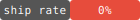

# AI Eval Results

  

## Product Eval — NOT READY (0.35/1.0)

```
4-Second Test         ███████████████░░░░░░░░░░░░░░░  0.5
Empty Room            █████████░░░░░░░░░░░░░░░░░░░░░  0.3
Creation→Distribution ███████████████░░░░░░░░░░░░░░░  0.5
Day 3 Return          ██████░░░░░░░░░░░░░░░░░░░░░░░░  0.2
Identity              ███████████████████░░░░░░░░░░░  0.63
Escape Velocity       █████████░░░░░░░░░░░░░░░░░░░░░  0.30
```

## Summary

| Metric | Value |
|--------|-------|
| Total evals | 3 |
| Ship rate | 0% |
| Ship | 0 |
| Ship with fixes | 2 |
| Blocked | 0 |
| Ceiling avg | 0.66 |

## Feature Evals

| Date | Feature | Verdict | Ceiling | Perspectives |
|------|---------|---------|---------|-------------|
| 2026-03-09 | hivelab-creation-engine | SHIP WITH FIXES | 0.64 | 0.52 |
| 2026-03-08 | phase1-shell-navigation | SHIP WITH FIXES | 0.68 | 0.67 |
| 2026-03-08 | full-product | NOT READY | — | — |

## Top Ceiling Gaps

| Gap | Frequency |
|-----|-----------|
| passive impact feedback — creator must manually check | 2x |
| no return pull — second visit identical to first | 2x |
| no primary share CTA in post-creation complete state | 1x |
| engagement data invisible at 20% opacity in MyAppsSection | 1x |
| no progressive code gen preview — spinner until complete | 1x |
| shell config labels barely readable (text-white/30) | 1x |
| code iteration not wired (existingCode never passed) | 1x |
| visual identity signals developer tool not campus culture | 1x |
| nav ordering puts Make 3rd despite creation being the bottleneck | 1x |

---
*Generated by [rhino-os](https://github.com/laneyfraass/rhino-os) · 2026-03-09*
