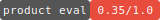

# AI Eval Results

  

## Product Eval — 2026-03-08

**Overall: 0.35/1.0 — NOT READY**

```
4-Second Test        ████████████░░░░░░░░░░░░░░░░░░  0.5
Empty Room           ██████████░░░░░░░░░░░░░░░░░░░░  0.3
Creation→Distribution████████████░░░░░░░░░░░░░░░░░░  0.5
Day 3 Return         ██████░░░░░░░░░░░░░░░░░░░░░░░░  0.2
Identity             ██████████░░░░░░░░░░░░░░░░░░░░  0.3
```

### Escape Velocity Breakdown

```
Network Effects      ████████████░░░░░░░░░░░░░░░░░░  0.4
Content Compounding  ██████████░░░░░░░░░░░░░░░░░░░░  0.3
Habit Formation      ██████░░░░░░░░░░░░░░░░░░░░░░░░  0.2
Viral Coefficient    ████████████████░░░░░░░░░░░░░░  0.5
Switching Cost       ████░░░░░░░░░░░░░░░░░░░░░░░░░░  0.1
                     ─────────────────────────────── avg: 0.30
```

### Competitive Position

| Screen | Competing With | Verdict |
|--------|---------------|---------|
| Feed/Home | Instagram Explore, Discord | **LOSES** |
| Spaces | Discord servers, GroupMe | **LOSES** |
| Create (/build) | IG Stories polls, Google Forms | **WINS** |
| Events | UB portal, word of mouth | TIES |
| Profile | LinkedIn, Instagram bio | **LOSES** |
| Share output | iMessage, GroupMe link | TIES |

> HIVE wins exactly one battle — creation. That win is real but insufficient when distribution, retention, and identity all lose to incumbents.

---

## Feature Evals

| Date | Feature | Deterministic | Functional | Ceiling | Perspectives | Verdict |
|------|---------|--------------|------------|---------|-------------|---------|
| 2026-03-08 | Shell Navigation | 9/9 | 8/8 | 0.68 | 0.67 | SHIP WITH FIXES |

---

## Ceiling Gaps (Feed Forward)

These gaps must be addressed by the next builder plan. Sorted by severity.

| Gap | Score | Required Action |
|-----|-------|----------------|
| No return pull | 0.2 | Push notifications for engagement milestones + space activity |
| Dead empty states | 0.3 | Contextual, warm, action-oriented empty states everywhere |
| Generic visual identity | 0.3 | Color, illustration, or photography that signals campus culture |
| Passive impact feedback | — | Real-time creation impact: live counts, push on milestones |
| Distribution afterthought | 0.5 | Share flow as primary post-creation action with native integrations |
| Browse-first IA | — | Reconsider default authenticated landing for creation-first product |

---

## What Would Change the Trajectory

1. **Creation-first IA + active distribution** — After auth, land on creation. After creating, one-tap share to GroupMe/iMessage/spaces. Connect the one competitive win to actual reach.

2. **Push-driven impact loop** — Poll hits 50 votes → push with results + "share again." Space member creates → push "Sarah made a bracket." Source of "something happened" not "go check."

3. **Visual identity that signals campus** — Color in shell, campus imagery in empty states, personality in copy, illustration that feels young + social. Current aesthetic repels target user.

---

*Generated by [rhino-os](https://github.com/laneyfraass/rhino-os) · 2026-03-08*
